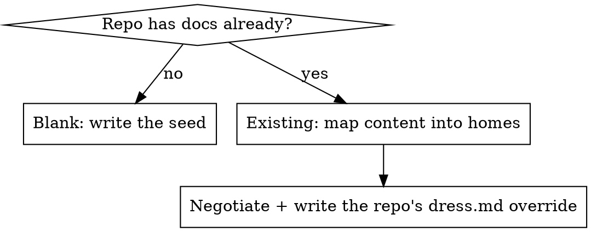

# loom — configurable skill behavior Implementation Plan

> **For agentic workers:** REQUIRED SUB-SKILL: Use superpowers:subagent-driven-development (recommended) or superpowers:executing-plans to implement this plan task-by-task. Steps use checkbox (`- [ ]`) syntax for tracking.

**Goal:** Lift each skill's baked-in repo assumptions into three tiers — MUST (in `SKILL.md`), DEFAULT (in `SKILL.md`, overridable), REPO OPINION (in per-repo `docs/config/loom/<skill>.md`) — so the harness conforms to a repo instead of imposing a shape.

**Architecture:** Two halves, mechanical then prose. (1) Scripts/config gain the data the skills will read: a `loom-config` doc `kind`, an optional `[skills] config_dir` knob with a linter *placement guardrail*, and a `[discovery] scaffolding` disposition that `doc-scan` partitions out. Override *resolution* is the agent's job (a skill reads `[skills] config_dir` → `<skill>.md`); scripts only validate and surface. (2) Each `SKILL.md` is rewritten around MUST + DEFAULT with a "load the override and let it shape these steps" step, lean "Use when…" descriptions, and one shared reference (`references/repo-overrides.md`) instead of N drifting schema copies.

**Tech Stack:** bash 3.2 + awk (no deps), Markdown with YAML frontmatter, TOML subset parsed by `scripts/lib/parse-toml.awk`. Tests are bash assertion scripts under `tests/`.

---

## Process notes (read before starting)

- **No RED-GREEN ceremony for the skill prose** (`SKILL.md`, templates, reference, override docs). The spec is the contract; the surface is too small and too unestablished to baseline-test. This waiver is deliberate and documented in the spec §8 and in memory `loom-next-session`.
- **The mechanical changes ARE testable and DO get tests.** loom's own `tests/` harness covers the linter, discover lib, and slicer. Where a MUST is mechanically checkable, code enforces it (spec §2). Tasks 1, 3, 4 add/extend tests and run `bash tests/run`; where natural, add the assertion first, watch it fail, then implement.
- **Prose tasks verify by `bash scripts/doc-linter` clean + read against the prose standard.** The standard is the root `README.md` (`## Why this project exists` / `## Core Principles`) — dense, concrete, opinionated, slop-free. Two registers, same blood: README is first-person owner's-stake; skills are second-person imperative. Memory `loom-prose-standard` holds the rules.
- **Dev process uses a feature branch + commits.** loom's own "stage, never commit" rule is the *runtime behavior of the skills on a repo* — it does not govern developing loom itself. Branch off `main`; commit per task.
- **`SKILL.md` files are NOT linted** (no `kind` frontmatter — they're scaffolding). So links *inside* skills are not machine-checked; verify skill→reference and skill→template links by hand (the target file must exist).

## File structure

**Scripts/config (mechanical):**
- `scripts/doc-linter` — add `loom-config` to embedded default kinds; add `[skills] config_dir` resolution + `check_placement` guardrail (new `PLACEMENT` finding).
- `scripts/lib/discover.sh` — add `doc_scaffolding`, `adoption_candidates`, `scaffolding_candidates`.
- `scripts/doc-scan` — print candidates partitioned into `# candidates` (adopt-or-leave) and `# scaffolding` (surfaced, don't pester).
- `docs/config/loom.toml` (loom's own) — add `loom-config` kind; add `[discovery] scaffolding`; later append `skills/dress/templates` to `exclude`.
- `skills/dress/templates/loom.toml` — add `loom-config` kind, `scaffolding` seed, commented `[skills] config_dir`.

**Templates/reference (new files):**
- `references/repo-overrides.md` — the one shared explanation of the three tiers + resolution (`kind: reference`, managed).
- `skills/dress/templates/{README.md, AGENTS.md, module-README.md, docs-README.md, dress.md}` — canonical-layout seeds, lifted out of dress's prose (excluded from discovery).

**Prose (rewrites):**
- `skills/dress/SKILL.md`, `skills/weave/SKILL.md`, `skills/weft/SKILL.md`, `skills/warp/SKILL.md`.
- `docs/README.md`, `AGENTS.md` — introduce the override/scaffolding vocabulary into loom's own durable docs.

**Dogfood + cleanup:**
- `docs/config/loom/dress.md` (new, `kind: loom-config`) — loom's own override, proving the mechanism end-to-end.
- `NOTES.md`, `docs/config/roadmap.md` — prune captured items, move the milestone.
- `docs/superpowers/{plans,specs}/*` — prune implemented plans/specs (last task).

**Tests:**
- `tests/test-doc-linter.sh` + fixtures — placement guardrail.
- `tests/test-discover.sh` — scaffolding partition.
- `tests/test-doc-slicer.sh` + fixture — lock `location` path-derivation.

---

## Task 0: Feature branch

**Files:** none (git only)

- [ ] **Step 1: Branch off main**

```bash
git checkout -b port/configurable-skill-behavior
git status
```
Expected: on a new branch, clean tree.

---

## Task 1: Lock `inject_fields = location` to path-derivation

The slicer already derives `location` from the doc's path (`hooks/doc-slicer` `annotate()`: `location) val="$rel"`), not from frontmatter. Spec §6 asks to *prove* it can't silently regress to reading a `location:` key. Add a misleading key to the fixture and assert the real path wins. (Characterization test — code is already correct.)

**Files:**
- Modify: `tests/fixtures/slice-repo/docs/config/roadmap.md` (frontmatter)
- Modify: `tests/test-doc-slicer.sh`

- [ ] **Step 1: Add a misleading `location:` key to the fixture's annotated doc**

In `tests/fixtures/slice-repo/docs/config/roadmap.md`, add a `location` line to the frontmatter so it reads:

```markdown
---
kind: roadmap
status: living
updated: 2026-06-23
location: BOGUS/should-not-appear.md
---
```

- [ ] **Step 2: Add the locking assertion**

In `tests/test-doc-slicer.sh`, after the existing `docs/config/roadmap.md` assertion (line 17) and before the `rm -rf "$R/.git"` on line 19, add:

```bash
assert_not_contains "$out" "BOGUS" "location annotation is path-derived, not read from frontmatter"
```

- [ ] **Step 3: Run the slicer tests**

Run: `bash tests/test-doc-slicer.sh`
Expected: all `ok`, file `passed`. (`docs/config/roadmap.md` still appears; `BOGUS` does not.)

- [ ] **Step 4: Commit**

```bash
git add tests/fixtures/slice-repo/docs/config/roadmap.md tests/test-doc-slicer.sh
git commit -m "test(slicer): lock location annotation to path-derivation"
```

---

## Task 2: Add the `loom-config` doc kind

`loom-config` is the `kind` for per-skill override docs (spec §3, §7 — distinct from `reference`, chosen for a cleaner guardrail). Add it everywhere the kind vocabulary is enumerated. No override docs exist yet; this just widens the vocabulary so they validate later.

**Files:**
- Modify: `scripts/doc-linter:14-26` (embedded `DEFAULT_CFG`)
- Modify: `docs/config/loom.toml:11`
- Modify: `skills/dress/templates/loom.toml:14`

- [ ] **Step 1: Add to the linter's embedded default kinds**

In `scripts/doc-linter`, in `DEFAULT_CFG`, add a line after `lint.kinds=review`:

```
lint.kinds=loom-config
```

- [ ] **Step 2: Add to loom's own config**

In `docs/config/loom.toml`, change the `kinds` line to append `"loom-config"`:

```toml
kinds = ["roadmap", "readme", "guide", "reference", "spec", "plan", "design", "review", "loom-config"]
```

- [ ] **Step 3: Add to the dress template config**

In `skills/dress/templates/loom.toml`, change the `kinds` line identically:

```toml
kinds = ["roadmap", "readme", "guide", "reference", "spec", "plan", "design", "review", "loom-config"]
```

- [ ] **Step 4: Verify loom still lints clean and tests pass**

Run: `bash scripts/doc-linter && bash tests/run`
Expected: `doc-linter: clean ✓`; `ALL TESTS PASSED`.

- [ ] **Step 5: Commit**

```bash
git add scripts/doc-linter docs/config/loom.toml skills/dress/templates/loom.toml
git commit -m "feat(lint): add loom-config doc kind to the vocabulary"
```

---

## Task 3: `[skills] config_dir` + linter placement guardrail

A `kind: loom-config` doc must live at `<config_dir>/<skill>.md` or the skill never finds it. `config_dir` defaults to `docs/config/loom`, relocatable via `[skills] config_dir`. The linter validates placement (spec §3: "discovery validates placement; it does not resolve the config"). Skill names are read from the plugin's own `skills/` dir (sibling of `scripts/`), so nothing is hardcoded and it works both in dogfood and when installed.

**Files:**
- Modify: `scripts/doc-linter` (config read, skill enumeration, `check_placement`, run loop, header comment)
- Create: `tests/fixtures/repo-clean/docs/config/loom/dress.md`
- Modify: `tests/fixtures/repo-clean/docs/config/loom.toml`
- Create: `tests/fixtures/repo-dirty/docs/loom-overrides/weave.md`
- Create: `tests/fixtures/repo-dirty/docs/config/loom/notaskill.md`
- Modify: `tests/fixtures/repo-dirty/docs/config/loom.toml`
- Modify: `tests/test-doc-linter.sh`

- [ ] **Step 1: Add the misplaced-doc fixtures and assertions FIRST (expect failure)**

Create `tests/fixtures/repo-clean/docs/config/loom/dress.md` (correctly placed — must stay clean):

```markdown
---
kind: loom-config
status: living
updated: 2026-06-23
---
# dress — repo overrides

A correctly placed override.
```

Add `loom-config` to `tests/fixtures/repo-clean/docs/config/loom.toml` kinds:

```toml
kinds = ["roadmap", "readme", "guide", "reference", "spec", "plan", "design", "review", "loom-config"]
```

Create `tests/fixtures/repo-dirty/docs/loom-overrides/weave.md` (wrong directory):

```markdown
---
kind: loom-config
status: living
updated: 2026-06-23
---
# misplaced override
```

Create `tests/fixtures/repo-dirty/docs/config/loom/notaskill.md` (right dir, no such skill):

```markdown
---
kind: loom-config
status: living
updated: 2026-06-23
---
# wrong basename
```

Add `loom-config` to `tests/fixtures/repo-dirty/docs/config/loom.toml` kinds (so only PLACEMENT fires, not a kind error). Read the file first; append `"loom-config"` to its `kinds` array exactly as above.

In `tests/test-doc-linter.sh`, add to the dirty-fixture assertions (after line 24, before the `rm` on line 26):

```bash
assert_contains "$dout" "PLACEMENT"        "reports misplaced loom-config doc"
assert_contains "$dout" "outside config_dir" "flags loom-config in the wrong directory"
assert_contains "$dout" "no skill named"   "flags loom-config with a non-skill basename"
```

Run: `bash tests/test-doc-linter.sh`
Expected: FAIL — the three `PLACEMENT` assertions fail (guardrail not implemented), and the clean fixture may now also fail if `loom-config` weren't accepted (it is, from Task 2 defaults, but the fixture toml override must list it — confirm clean fixture still `ok`).

- [ ] **Step 2: Read `[skills] config_dir` and enumerate skills in the linter**

In `scripts/doc-linter`, after `STATUSES="$(cfg_get lint.statuses)"` (line 36), add:

```bash
CONFIG_DIR="$(cfg_get skills.config_dir)"; CONFIG_DIR="${CONFIG_DIR:-docs/config/loom}"; CONFIG_DIR="${CONFIG_DIR%/}"

# Known skills = basenames of the plugin's skills/ dirs (sibling of scripts/). Empty if absent.
SKILLS=""
for _d in "$SELF_DIR"/../skills/*/; do
  [ -d "$_d" ] || continue
  _b="${_d%/}"; _b="${_b##*/}"
  SKILLS="$SKILLS$_b
"
done
```

- [ ] **Step 3: Add `check_placement`**

In `scripts/doc-linter`, after `check_frontmatter` (after line 106), add:

```bash
check_placement() { # $1=file $2=kind  — loom-config docs must live at <config_dir>/<skill>.md
  [ "$2" = "loom-config" ] || return 0
  local f="$1" rel dir base; rel="${f#"$ROOT"/}"
  dir="$(dirname "$rel")"; base="$(basename "$rel" .md)"
  if [ "$dir" != "$CONFIG_DIR" ]; then
    add "PLACEMENT $rel: loom-config outside config_dir ($CONFIG_DIR/) — its skill won't find it"
    return
  fi
  if [ -n "$SKILLS" ] && ! in_list "$base" "$SKILLS"; then
    add "PLACEMENT $rel: no skill named '$base' — name a loom-config doc after the skill it configures"
  fi
}
```

- [ ] **Step 4: Call it in the run loop**

In `scripts/doc-linter`, change the run loop (lines 109-114) to extract the kind (via `frontmatter_field`, already sourced from `discover.sh`) and call the guard:

```bash
while IFS= read -r rel; do
  [ -n "$rel" ] || continue
  f="$ROOT/$rel"
  check_links "$f"
  check_frontmatter "$f"
  check_placement "$f" "$(frontmatter_field "$f" kind)"
done < <(managed_docs "$ROOT")
```

- [ ] **Step 5: Update the linter header comment**

In `scripts/doc-linter`, extend the `# Checks:` comment (line 4) to name the new check:

```
# Checks: BROKEN, CODELINK, MISSING (links); FRONTMATTER (kind/status/updated); PLACEMENT (loom-config docs).
```

- [ ] **Step 6: Run the linter tests, then the full suite**

Run: `bash tests/test-doc-linter.sh`
Expected: all `ok` — clean fixture clean (loom-config accepted + correctly placed), dirty fixture reports `PLACEMENT`, `outside config_dir`, `no skill named`.

Run: `bash tests/run`
Expected: `ALL TESTS PASSED`.

- [ ] **Step 7: Verify loom itself still lints clean**

Run: `bash scripts/doc-linter`
Expected: `doc-linter: clean ✓` (loom has no loom-config docs yet, so the guard is inert).

- [ ] **Step 8: Commit**

```bash
git add scripts/doc-linter tests/
git commit -m "feat(lint): placement guardrail for loom-config override docs"
```

---

## Task 4: `[discovery] scaffolding` disposition

Two dispositions, kept distinct (spec §4): `exclude` removes a tree from the universe entirely; `scaffolding` keeps it as a *candidate* but tells the skills not to pester about adopting it. `doc-scan` partitions candidates so the skills can stop literally naming `docs/superpowers/`.

**Files:**
- Modify: `scripts/lib/discover.sh` (add `doc_scaffolding`, `adoption_candidates`, `scaffolding_candidates`)
- Modify: `scripts/doc-scan`
- Modify: `docs/config/loom.toml` (add `scaffolding`)
- Modify: `tests/test-discover.sh`

- [ ] **Step 1: Add the scaffolding-partition assertions FIRST (expect failure)**

In `tests/test-discover.sh`, before `finish` (line 47), add a new block:

```bash
# Scaffolding: a [discovery] scaffolding prefix partitions candidates (surfaced, not adopted).
rm -rf "$R/.git" "$R/docs" "$R/scaffold"
mkdir -p "$R/docs/config" "$R/scaffold"
printf '[discovery]\nscaffolding = ["scaffold"]\n' > "$R/docs/config/loom.toml"
printf '# plain\n\nNo frontmatter.\n' > "$R/scaffold/note.md"
( cd "$R" && git init -q . && git add a.md b.md sub/c.md .gitignore docs/config/loom.toml scaffold/note.md )
adopt="$(adoption_candidates "$R")"
scaf="$(scaffolding_candidates "$R")"
assert_contains     "$scaf"  "scaffold/note.md" "scaffolding candidate surfaced under scaffolding"
assert_not_contains "$adopt" "scaffold/note.md" "scaffolding candidate excluded from adoption list"
assert_contains     "$adopt" "b.md"             "non-scaffolding candidate stays in adoption list"
rm -rf "$R/.git" "$R/docs" "$R/scaffold"
```

Run: `bash tests/test-discover.sh`
Expected: FAIL — `adoption_candidates`/`scaffolding_candidates` are undefined (command not found).

- [ ] **Step 2: Add the discover.sh functions**

In `scripts/lib/discover.sh`, after `omission_candidates` (after line 81), add:

```bash
# scaffolding path-prefixes from [discovery] scaffolding (surfaced as candidates, not adopted)
doc_scaffolding() { # $1=ROOT
  local conf="$1/docs/config/loom.toml"
  [ -f "$conf" ] || return 0
  awk -f "$_DISCOVER_DIR/parse-toml.awk" "$conf" 2>/dev/null \
    | awk -F= '$1=="discovery.scaffolding"{sub(/^[^=]*=/,""); print}'
}

adoption_candidates() { # $1=ROOT  -> frontmatter-less docs NOT under a scaffolding prefix
  local root="$1" scaf rel; scaf="$(doc_scaffolding "$root")"
  omission_candidates "$root" | while IFS= read -r rel; do
    [ -n "$rel" ] || continue
    _excluded "$rel" "$scaf" || printf '%s\n' "$rel"
  done
}

scaffolding_candidates() { # $1=ROOT  -> frontmatter-less docs under a scaffolding prefix
  local root="$1" scaf rel; scaf="$(doc_scaffolding "$root")"
  omission_candidates "$root" | while IFS= read -r rel; do
    [ -n "$rel" ] || continue
    _excluded "$rel" "$scaf" && printf '%s\n' "$rel"
  done
}
```

(`_excluded` already exists as a generic "does path match any prefix in this list" helper; reuse it.)

- [ ] **Step 3: Partition the doc-scan output**

Replace the body of `scripts/doc-scan` (lines 10-13) with:

```bash
printf '# managed (%s)\n' "$ROOT"
managed_docs "$ROOT"
printf '# candidates — markdown without kind frontmatter (adopt as managed, or leave)\n'
adoption_candidates "$ROOT"
printf '# scaffolding — config-declared unmanaged trees (surfaced, do not pester)\n'
scaffolding_candidates "$ROOT"
```

- [ ] **Step 4: Declare loom's own scaffolding**

In `docs/config/loom.toml`, change the `[discovery]` table to:

```toml
[discovery]
exclude = ["tests/fixtures"]
scaffolding = ["docs/superpowers", "skills"]
```

- [ ] **Step 5: Run discover tests, full suite, and eyeball doc-scan**

Run: `bash tests/test-discover.sh && bash tests/run`
Expected: all `ok`; `ALL TESTS PASSED`.

Run: `bash scripts/doc-scan`
Expected: `docs/superpowers/...` and `skills/*/SKILL.md` now appear under `# scaffolding`, not `# candidates`.

- [ ] **Step 6: Commit**

```bash
git add scripts/lib/discover.sh scripts/doc-scan docs/config/loom.toml tests/test-discover.sh
git commit -m "feat(discovery): scaffolding disposition partitioned by doc-scan"
```

---

## Task 5: Shared override reference + loom's durable docs

One home for the override mechanism (spec §5.5): a plugin-side `references/repo-overrides.md` every skill links to, instead of each `SKILL.md` restating the schema. Then teach loom's own `docs/README.md` and `AGENTS.md` the override + scaffolding vocabulary, replacing the literal `docs/superpowers/` scaffolding sentence with the config-declared framing (spec §6).

**Files:**
- Create: `references/repo-overrides.md`
- Modify: `docs/README.md`
- Modify: `AGENTS.md`

- [ ] **Step 1: Create the shared reference**

Create `references/repo-overrides.md`:

```markdown
---
kind: reference
status: living
updated: 2026-06-24
---
# Repo overrides — how a skill bends to a repo

loom's skills ship one read-only copy inside the plugin. Repo-specific behavior is **data the
skill reads**, never an edit baked into the shipped file. Every skill instruction is exactly
one tier:

- **MUST** — the invariant contract loom depends on. Non-overridable; stated in `SKILL.md`.
- **DEFAULT** — a sensible suggestion that works out of the box but may be wrong for a repo.
  Stated in `SKILL.md`, marked overridable.
- **REPO OPINION** — how *this* repo wants it done. Lives in the repo's override doc, not the
  skill.

## Where a skill finds its override

Resolution is deterministic: `<config_dir>/<skill>.md`, where `<skill>` is the skill name
(`dress` · `weave` · `weft` · `warp`) and `config_dir` defaults to `docs/config/loom`,
relocated for the whole set by `[skills] config_dir` in `docs/config/loom.toml`. No override
present means run the DEFAULTs. Load it and let it shape the DEFAULT steps — **it shapes how a
step is applied; it never disables a MUST.**

## Override docs are first-class

Each override opens with frontmatter `kind: loom-config`, so it is linted and discovered like
any managed doc — there is no frontmatter-free tier. The linter enforces *placement*: a
`kind: loom-config` doc must sit at `<config_dir>/<skill>.md`, or it is flagged, because the
skill would never look anywhere else. TOML locates; frontmatter classifies.
```

- [ ] **Step 2: Teach `docs/README.md` the override + scaffolding vocabulary**

In `docs/README.md`, in the "Config drives behavior" bullet (lines 18-20), append a sentence pointing at overrides:

```markdown
  out of the managed set. `[skills] config_dir` locates per-skill override docs
  (`kind: loom-config`) that carry a repo's own opinions — see
  [repo-overrides](../references/repo-overrides.md).
```

Then replace the final paragraph (lines 24-26, the literal `docs/superpowers/` scaffolding sentence) with the config-declared framing:

```markdown
Markdown that looks like a doc but isn't loom's to manage is declared in `[discovery]
scaffolding` — `doc-scan` surfaces it under its own heading and the skills never pester about
adopting it. loom's own scaffolding is the design specs/plans under `docs/superpowers/` and the
plugin's `skills/`.
```

- [ ] **Step 3: Add an overrides pointer to `AGENTS.md`**

In `AGENTS.md`, under `## Agentic Guidelines`, add a third bullet after the `loom.toml` one (line 14):

```markdown
- Per-skill REPO OPINION lives in `docs/config/loom/<skill>.md` (`kind: loom-config`); the
  mechanism is documented in [repo-overrides](references/repo-overrides.md).
```

- [ ] **Step 4: Lint loom (these are managed docs; links must resolve)**

Run: `bash scripts/doc-linter`
Expected: `doc-linter: clean ✓`. (`references/repo-overrides.md` is now a managed `reference`; the new links from `docs/README.md` and `AGENTS.md` resolve to it.)

- [ ] **Step 5: Commit**

```bash
git add references/repo-overrides.md docs/README.md AGENTS.md
git commit -m "docs: shared repo-overrides reference; config-declared scaffolding"
```

---

## Task 6: Lift the canonical layout into dress templates

Stop hardcoding the canonical headers as law in dress's prose (spec §4, §6). The seed becomes real files under `skills/dress/templates/` that dress copies into a blank repo; dress's body points at them as a DEFAULT. Template `.md` files carry `kind` frontmatter, so they would otherwise be discovered as managed docs — exclude `skills/dress/templates` exactly the way `tests/fixtures` is excluded.

**Files:**
- Create: `skills/dress/templates/README.md`
- Create: `skills/dress/templates/AGENTS.md`
- Create: `skills/dress/templates/module-README.md`
- Create: `skills/dress/templates/docs-README.md`
- Create: `skills/dress/templates/dress.md`
- Modify: `skills/dress/templates/loom.toml`
- Modify: `docs/config/loom.toml` (append the templates dir to `exclude`)

- [ ] **Step 1: Root README seed**

Create `skills/dress/templates/README.md`:

```markdown
---
kind: readme
status: living
updated: <YYYY-MM-DD>
---
# <project>

<One line: what this is and who it's for.>

## Overview

<What the project does and why it exists, in two or three sentences. The 20,000-ft view.>

## Module Map

<Each top-level module on one line, linking to its own README — what it owns, not how it works.>

## Getting Started

<The shortest path from clone to running.>
```

- [ ] **Step 2: AGENTS router seed**

Create `skills/dress/templates/AGENTS.md`:

```markdown
---
kind: reference
status: living
updated: <YYYY-MM-DD>
---
# AGENTS

<One line on what this repo is, for an agent landing here cold.>

## Agentic Guidelines

<Global, durable build/validation conventions. Module-specific guidance lives in the module READMEs.>

## Agentic Validation

<The commands that prove a change is sound — tests, linters, type checks.>
```

- [ ] **Step 3: Module README seed**

Create `skills/dress/templates/module-README.md`:

```markdown
---
kind: readme
status: living
updated: <YYYY-MM-DD>
---
# <module>

## Overview

<What this module owns and why it exists.>

## Setup

<What it takes to work in this module, if anything beyond the repo root.>

## Structure

<The shape worth knowing before editing — the few files/dirs that matter, not an inventory.>

## Agentic Guidelines

<Durable decisions and constraints specific to this module.>

## Agentic Validation

<How to prove a change here is sound.>
```

- [ ] **Step 4: docs/README seed**

Create `skills/dress/templates/docs-README.md`:

```markdown
---
kind: readme
status: living
updated: <YYYY-MM-DD>
---
# How docs work here

<The source of truth for this repo's doc model: taxonomy, lifecycle, nomenclature, ethos.
Everything else implements what this file declares. Keep it short; it is read often.>
```

- [ ] **Step 5: Example override seed**

Create `skills/dress/templates/dress.md`:

```markdown
---
kind: loom-config
status: living
updated: <YYYY-MM-DD>
---
# dress — repo overrides

<This repo's opinion on layout and tracking. Each entry shapes a dress DEFAULT; none disables
a MUST. Delete this seed prose and write only what differs from the defaults.>

- **Canonical headers:** <the headers this repo actually uses, if not the seed's
  Overview / Module Map / Getting Started.>
- **Modules:** <which top-level dirs are modules, if discovery's guess is wrong.>
- **Scaffolding:** <trees to declare in `[discovery] scaffolding` — surfaced, not adopted.>
```

- [ ] **Step 6: Update the template loom.toml**

Rewrite `skills/dress/templates/loom.toml` to seed the new knobs:

```toml
# loom.toml — per-repo harness config. The plugin ships generic code; this drives it.
# [context] tunes the SessionStart slice; [lint] is the validation vocabulary;
# [discovery] keeps chosen trees out of (exclude) or flagged-but-unmanaged in (scaffolding)
# the managed set; [skills] locates per-skill REPO OPINION overrides.

[discovery]
exclude = []        # path-prefix trees to drop entirely, e.g. ["tests/fixtures", "vendor"]
scaffolding = []    # trees surfaced as candidates but never pestered about, e.g. ["docs/superpowers"]

# [skills]
# config_dir = "docs/config/loom"   # default; relocate the whole set of <skill>.md overrides

[context]
recent_commits = 15
slice_headers = ["## Now", "## Module Map"]   # sections to harvest, by header (path-free)
inject_fields = ["updated", "kind", "location"]  # frontmatter to prefix each slice with

[lint]
kinds = ["roadmap", "readme", "guide", "reference", "spec", "plan", "design", "review", "loom-config"]
statuses = ["living", "hardened", "superseded", "scaffolding", "ideation"]
```

- [ ] **Step 7: Exclude the templates from loom's own discovery**

In `docs/config/loom.toml`, append the templates dir to `exclude`:

```toml
exclude = ["tests/fixtures", "skills/dress/templates"]
```

- [ ] **Step 8: Verify discovery ignores templates and loom lints clean**

Run: `bash scripts/doc-scan`
Expected: no `skills/dress/templates/*.md` under any heading (excluded).

Run: `bash scripts/doc-linter && bash tests/run`
Expected: `doc-linter: clean ✓`; `ALL TESTS PASSED`.

- [ ] **Step 9: Commit**

```bash
git add skills/dress/templates docs/config/loom.toml
git commit -m "feat(dress): canonical layout as template seeds, excluded from discovery"
```

---

## Task 7: Rewrite `skills/dress/SKILL.md`

Restructure around MUST + DEFAULT, seed-from-templates, override-loading, and a fresh-vs-existing flowchart (the one genuinely non-obvious branch — spec §5.4). Replace literal scaffolding references and the inlined schema with links to the template and the shared reference (spec §5.1, §5.5, §5.6). Apply the prose standard (second-person imperative, zero hedge).

**Files:** Modify `skills/dress/SKILL.md`

**Tier decomposition to encode:**
- **MUST:** stage, never commit · end lint-clean (`doc-linter` exit 0) · write `docs/config/loom.toml` (the invariant anchor) · cohesion (never leave a cross-reference pointing at an old shape) · existing repo: never clobber existing prose silently.
- **DEFAULT (overridable):** the canonical layout seeded from `templates/` · the `docs/{specs,plans,design,diagrams}/` scaffold · `config_dir = docs/config/loom` · start the slice list maximal, then trim.
- **REPO OPINION (dress writes into the repo, never states in the skill):** the chosen layout / module set / scaffolding trees / `config_dir` — captured in the repo's own `docs/config/loom/dress.md`.

- [ ] **Step 1: Replace the description with a lean trigger**

Set the frontmatter `description` to:

```
description: Use when adopting loom on a repo, or re-tuning what it tracks — context slices, lint vocabulary, scaffolding disposition, or doc layout. Stands up (or re-tunes) the harness and proves it lint-clean.
```

- [ ] **Step 2: Rewrite the body**

Produce a body with these sections (final wording per the prose standard; keep dress's existing facilitator-loop and re-tune content, restructured under the tiers):

1. **Opening** — one paragraph: dress stands up or re-tunes the harness conversationally; the source of truth is `docs/README.md`; everything else implements it. State the MUSTs inline as the non-negotiable frame: *stage, never commit; write `docs/config/loom.toml`; end lint-clean; never break a cross-reference.*
2. **Repo overrides** — the load step: "Read `docs/config/loom/dress.md` if present (relocatable via `[skills] config_dir`) and let it shape the DEFAULT layout/seeds below. It shapes; it never disables a MUST. See `../../references/repo-overrides.md`."
3. **Fresh vs. existing** — a small flowchart (the non-obvious branch):



   - **Blank repo:** copy the seeds from `templates/` (`README.md`, `AGENTS.md`, `module-README.md`, `docs-README.md`, `loom.toml`, and the `dress.md` override stub), fill the angle-bracket placeholders, set every `updated` to today's ISO date. The seed is a DEFAULT, not law.
   - **Existing repo:** inventory what exists, **map content into homes** rather than overwrite (fold an existing intro into the repo's own Overview, derive the module map from real top-level dirs, flag gaps for `/weft` instead of inventing detail), and write the repo's `docs/config/loom/dress.md` capturing where it diverges from the seed. Never clobber existing prose silently.
4. **The config** — keep the `[context]`/`[lint]`/`[discovery]` explanation but compress: state that `loom.toml` is the invariant anchor and the three tables drive the slicer/linter/discovery; for the schema detail point at `templates/loom.toml` (the seed documents every table) rather than restating it. Add the new knobs: `[discovery] scaffolding` (surface-don't-pester) vs `exclude` (drop entirely), and `[skills] config_dir`.
5. **Re-tune (the facilitator loop)** — keep the existing render→tune→re-render loop verbatim in intent (`hooks/doc-slicer` render with per-slice cost, tune `[context]`/`[lint]`/`[discovery]`, loop). This is dress's re-tune mode.
6. **Cohesion** — keep the binding invariant: generate every dependent artifact *from* `docs/README.md`; offer pivots; never leave a reference pointing at the old shape.
7. **Self-check** — end by running `bash "${CLAUDE_PLUGIN_ROOT}/scripts/doc-linter"`; born lint-clean proves the cross-reference web is coherent.
8. **Red flags** — a short rationalization table next to the MUSTs:

| Thought | Reality |
|---|---|
| "This repo obviously wants the canonical layout — skip the negotiation." | The seed is a DEFAULT. An existing repo gets its content mapped and its own `dress.md`, never the seed imposed. |
| "I'll just overwrite the stale README intro." | Never clobber existing prose silently — fold it into a home, or flag the gap. |
| "It's basically clean; I'll commit the scaffold." | dress stages; it never commits. The operator commits. |

9. **Output** — keep: report scaffolded vs mapped, pivots chosen, the `loom.toml` written, the repo's `dress.md` if one was written, gaps flagged for `/weft`, the clean lint run.

- [ ] **Step 3: Verify links resolve by hand (SKILL.md is not linted)**

Run: `ls skills/dress/templates/ references/repo-overrides.md`
Expected: every file referenced from the rewritten skill exists (`templates/README.md`, `templates/AGENTS.md`, `templates/module-README.md`, `templates/docs-README.md`, `templates/loom.toml`, `templates/dress.md`, `references/repo-overrides.md`).

- [ ] **Step 4: Read against the prose standard**

Re-read the rewritten `skills/dress/SKILL.md` against `README.md`'s `## Why this project exists`. Cut any line that doesn't change what the agent does. Confirm: lean "Use when…" description, MUST/DEFAULT explicit, no literal `docs/superpowers/`, schema not re-inlined.

- [ ] **Step 5: Commit**

```bash
git add skills/dress/SKILL.md
git commit -m "docs(dress): MUST/DEFAULT rewrite, template seeds, override-loading"
```

---

## Task 8: Rewrite `skills/weave/SKILL.md`

Whole-tree reconcile. Make the MUSTs explicit, route the scaffolding decision through `doc-scan`'s partition (no literal `docs/superpowers/`), and add the override-loading step. Keep the existing 7-step workflow; reframe, don't rebuild.

**Files:** Modify `skills/weave/SKILL.md`

**Tier decomposition:**
- **MUST:** enumerate via `doc-scan` (deterministic membership), not agentic globbing · run `doc-linter` and fix what it flags · stage, never commit.
- **DEFAULT (overridable via `weave.md`):** the staleness/duplication/low-leverage heuristics · the progressive-disclosure read order · which trees are scaffolding (read from `doc-scan`'s `# scaffolding` partition, declared in `[discovery] scaffolding`).
- **REPO OPINION:** captured in `docs/config/loom/weave.md`.

- [ ] **Step 1: Replace the description**

```
description: Use when docs have drifted after many sessions, milestones, or reviews and the whole tree needs reconciling against the current code. The whole-tree complement to weft's session-delta distill.
```

- [ ] **Step 2: Rewrite the body**

1. **Opening** — one paragraph: reconcile the whole tree, re-derived from the code, into a small durable navigation layer aligned to `docs/README.md`; docs are routing + decision context, not a log. State the MUSTs as the frame.
2. **Repo overrides** — load step: "Read `docs/config/loom/weave.md` if present and let it shape the DEFAULT heuristics below; it never relaxes the MUSTs. See `../../references/repo-overrides.md`."
3. **Workflow** — keep steps 1-7 in intent, with two edits:
   - Step 1 (enumerate) is a **MUST**: `bash "${CLAUDE_PLUGIN_ROOT}/scripts/doc-scan"`, not agentic globbing — membership must be deterministic.
   - Step 2 (omissions): replace the literal "`docs/superpowers/` specs/plans and skill `SKILL.md` files are scaffolding" with: "`doc-scan` prints `# scaffolding` separately (config-declared `[discovery] scaffolding`) — list those but don't pester about adopting them; ask only about the `# candidates` and the `git status` new/deleted managed docs."
   - Steps 3-6 (identify/relocate/normalize/rewrite) become **DEFAULT** heuristics, shapeable by `weave.md`.
   - Step 7 (lint) is a **MUST**: run `doc-linter`, fix flags, stage, do not commit.
4. **Red flags** — short table:

| Thought | Reality |
|---|---|
| "Globbing the docs is faster than `doc-scan`." | Membership must be deterministic and discovery-driven; globbing drifts from the managed set. |
| "I'll adopt this stray markdown to be safe." | If it's under `[discovery] scaffolding`, surface it and move on — don't pester. |

5. **Output** — keep: docs reviewed, files changed with one-line rationales, validation, and why nothing changed where nothing did.

- [ ] **Step 3: Verify + read against the standard**

Run: `ls references/repo-overrides.md` (link target exists). Re-read against the prose standard; confirm no literal `docs/superpowers/`, MUSTs explicit, lean description.

- [ ] **Step 4: Commit**

```bash
git add skills/weave/SKILL.md
git commit -m "docs(weave): MUST/DEFAULT rewrite, scaffolding via doc-scan, override-loading"
```

---

## Task 9: Rewrite `skills/weft/SKILL.md`

Session-delta distill + close-out. The close-out **gate** is the headline MUST and the place to close loopholes explicitly (spec §5.2, §5.3). Route pruning through the config-declared scaffolding. Add override-loading. Keep the two-invocation structure (`/weft` and `/weft into <branch>`).

**Files:** Modify `skills/weft/SKILL.md`

**Tier decomposition:**
- **MUST:** the close-out gate — lint clean AND untracked/missing check both pass before merge; `--no-ff` explicit merge commit, never a fast-forward; commit ONLY on close-out opt-in (plain `/weft` stages, never commits); run `doc-linter`.
- **DEFAULT (overridable via `weft.md`):** what to distill where (module `## Overview`, decisions into `## Agentic Guidelines`, roadmap on milestones) · pruning targets = config-declared scaffolding + `weft.md` · the branch/close-out naming convention.
- **REPO OPINION:** `docs/config/loom/weft.md`.

- [ ] **Step 1: Replace the description**

```
description: Use when wrapping up a work session — distill landed changes into the durable docs and optionally close out the branch (gate, commit, merge). Invoke as "weft into <branch>" to name the merge target up front.
```

- [ ] **Step 2: Rewrite the body**

1. **Opening** — keep: distill the session delta (not the whole tree) into durable docs per `docs/README.md`; editorial before additive; no edit without durable signal. Keep the two invocations (`/weft`, `/weft into <branch>`).
2. **Repo overrides** — load step: "Read `docs/config/loom/weft.md` if present; it shapes *what* you distill and *where*, and names the branch convention. It never relaxes the gate. See `../../references/repo-overrides.md`."
3. **Distill (both modes)** — keep steps 1-7 in intent. Edit step 2 (surface uncommitted): use `doc-scan` + `git status --porcelain -- '*.md'`; the `# scaffolding` partition is declared, don't pester. Edit step 5 (prune): "prune implemented `docs/{specs,plans}` and graduated `docs/design` ideation once their essence is captured above — the prunable scaffolding is whatever `[discovery] scaffolding` declares, not a hardcoded path." Mark steps 3-6 as DEFAULT distill targets, shapeable by `weft.md`. Step 7 (lint + `git add`) stays.
4. **Close out (on opt-in)** — keep steps 8-11, and harden the **gate** (step 8) as the central MUST with an explicit no-loophole list:
   - The gate is two checks, both must pass: lint clean (`doc-linter` exit 0) AND the untracked/missing check (`git status --porcelain`, surface every `??` and ` D`).
   - **Never merge through a failing gate. No exceptions** — not "it's a trivial doc change," not "lint is almost clean, I'll fix after the merge," not "the stray file is unrelated." Stop and report instead.
   - The merge is always `git merge --no-ff` with a written merge-commit message — never a fast-forward.
   - Commit happens only here, on opt-in. Plain `/weft` that the operator declines to close out leaves the diff staged and uncommitted.
5. **Red flags** — table next to the gate:

| Thought | Reality |
|---|---|
| "It's a trivial doc change — skip the gate." | The gate has no size exemption. Lint + clean tree, every time. |
| "Lint is almost clean; merge and fix after." | Never merge through a failing gate. Fix first, then merge. |
| "A fast-forward is cleaner here." | Always `--no-ff`. The explicit merge commit is the record. |
| "Plain `/weft`, but I'll commit to be helpful." | Plain `/weft` stages only. Committing is the operator's opt-in. |

6. **Output** — keep, including the close-out reporting (gate result, sync commit, merge commit, cleanup).

- [ ] **Step 3: Verify + read against the standard**

Run: `ls references/repo-overrides.md`. Re-read against the prose standard; confirm the gate's no-loophole list reads tight, no literal `docs/superpowers/`, lean description.

- [ ] **Step 4: Commit**

```bash
git add skills/weft/SKILL.md
git commit -m "docs(weft): MUST gate with closed loopholes, config-declared pruning, override-loading"
```

---

## Task 10: Reframe `skills/warp/SKILL.md`

warp stays a stub (spec §7 — likely the first skill that's *mostly* REPO OPINION, so it waits for the override mechanism it now has). Minimal change: lean "Use when…" description, and note that its eventual behavior is REPO OPINION shaped by `warp.md`. Do not build machinery.

**Files:** Modify `skills/warp/SKILL.md`

- [ ] **Step 1: Replace the description**

```
description: Use when opening a unit of work — naming the branch, setting up a worktree, pulling in ticket/PR context so a session boots oriented. The session-open complement to weft. Status — stub; reports that it is not yet implemented.
```

- [ ] **Step 2: Add one line on the override path**

In the body, keep the `Status: stub` framing and the intended scope, and add a sentence: warp's eventual behavior is mostly REPO OPINION — branch convention, worktree policy, ticket source — and will be shaped per-repo by `docs/config/loom/warp.md` (see `../../references/repo-overrides.md`) once built. Keep the "if invoked now, it's a stub; point at `/weft` and `/dress`" behavior.

- [ ] **Step 3: Commit**

```bash
git add skills/warp/SKILL.md
git commit -m "docs(warp): lean trigger description, note the override path"
```

---

## Task 11: Dogfood — write loom's own `dress.md` override

Prove the mechanism end-to-end on loom itself (spec §1: loom's README violates the seed's `## Overview` — that divergence is now a documented REPO OPINION, not a hardcoded assumption). This creates the repo's first real `kind: loom-config` doc: discovered, linted, correctly placed.

**Files:** Create `docs/config/loom/dress.md`

- [ ] **Step 1: Write the override**

Create `docs/config/loom/dress.md`:

```markdown
---
kind: loom-config
status: living
updated: 2026-06-24
---
# dress — loom's own overrides

loom's `README.md` is first-person and owner-staked; it does not use the seed's
`## Overview` / `## Module Map` / `## Getting Started`. Treat its real shape as canonical and
do not re-impose the seed.

- Root `README.md` headers: `## Why this project exists` · `## Core Principles` ·
  `## How it works` · `## Naming (textile ethos)` · `## Try it`.
- This repo is flat — no module READMEs yet; the scripts, hooks, and skills are the units.
- Scaffolding declared in `[discovery] scaffolding`: the design specs/plans under
  `docs/superpowers/`, and the plugin's `skills/`. Surface them, never pester.
```

- [ ] **Step 2: Verify discovery, placement, and lint**

Run: `bash scripts/doc-scan`
Expected: `docs/config/loom/dress.md` appears under `# managed`.

Run: `bash scripts/doc-linter`
Expected: `doc-linter: clean ✓` — `loom-config` accepted, placement passes (`docs/config/loom/` is the default `config_dir`, `dress` is a real skill).

- [ ] **Step 3: Commit**

```bash
git add docs/config/loom/dress.md
git commit -m "docs: loom's own dress override (dogfood the loom-config mechanism)"
```

---

## Task 12: Prune captured scaffolding + move the roadmap

Now that the scaffolding disposition is config (so we are not re-hardcoding "leave them" vs "drop them"), prune what is captured (spec §6, per weft's own rule). Move the roadmap on this milestone. This task is loom running its own `/weft` distill by hand; surface every deletion.

**Files:**
- Modify: `NOTES.md`
- Modify: `docs/config/roadmap.md`
- Delete: implemented `docs/superpowers/plans/*` and `docs/superpowers/specs/*` (enumerated below)

- [ ] **Step 1: Prune captured NOTES.md items**

In `NOTES.md`, remove the "Omission-sweep noise" bullet (now captured by `[discovery] scaffolding` + `docs/README.md` + `references/repo-overrides.md`). Keep the still-open items (warp, Manifests, Invisible README frontmatter). In the Status section, add one line: `[discovery] scaffolding` surfaces-but-doesn't-pester trees; per-skill REPO OPINION lives in `docs/config/loom/<skill>.md`.

- [ ] **Step 2: Move the roadmap**

In `docs/config/roadmap.md`: set `updated: 2026-06-24`; refresh `## Now` to reflect that the harness is now config-conforming (MUST/DEFAULT/REPO-OPINION tiers, per-skill overrides); leave `## Next` as smoke-test + build warp; add a checked milestone:

```markdown
- [x] Configurable skill behavior (MUST/DEFAULT/REPO-OPINION tiers + per-skill overrides)
```

- [ ] **Step 3: Prune implemented plans/specs**

Confirm each is implemented (essence now in the skills/config/reference), then delete:

```bash
git rm docs/superpowers/plans/2026-06-23-loom-core-scripts.md \
       docs/superpowers/plans/2026-06-23-loom-discovery-frontmatter.md \
       docs/superpowers/plans/2026-06-23-loom-skills-and-cleanup.md \
       docs/superpowers/specs/2026-06-23-loom-discovery-frontmatter-redesign.md \
       docs/superpowers/specs/2026-06-23-loom-plugin-port-design.md
```

Leave this plan and the `2026-06-24` spec in place until the very end of the step (they are the contract being executed); delete them last:

```bash
git rm docs/superpowers/specs/2026-06-24-loom-configurable-skill-behavior.md \
       docs/superpowers/plans/2026-06-24-loom-configurable-skill-behavior.md
```

- [ ] **Step 4: Final full verification**

Run: `bash scripts/doc-linter && bash tests/run`
Expected: `doc-linter: clean ✓`; `ALL TESTS PASSED`.

Run: `bash scripts/doc-scan`
Expected: managed set includes `references/repo-overrides.md` and `docs/config/loom/dress.md`; `# scaffolding` now lists only `skills/*/SKILL.md` (the `docs/superpowers/` tree is pruned).

- [ ] **Step 5: Commit**

```bash
git add NOTES.md docs/config/roadmap.md docs/superpowers
git commit -m "docs(weft): prune implemented plans/specs, move roadmap on milestone"
```

---

## Self-review

**Spec coverage** (each spec section → task):
- §2 three tiers (MUST/DEFAULT/REPO OPINION) → Tasks 7-10 (encoded per skill), §2 "code enforces mechanically checkable MUSTs" → Tasks 3 (placement), existing linter gate.
- §3 override location + resolution + frontmatter guardrail → Tasks 3 (guardrail), 5 (reference), and the load-steps in 7-10.
- §4 lift assumptions: canonical layout → Tasks 6 (templates) + 7 (dress fresh-vs-existing); `docs/superpowers/` scaffolding → Task 4 (disposition) + 5/8/9 (deliteralize); prune destinations/close-out → Tasks 8, 9 (REPO OPINION).
- §5 patterns: .1 lean descriptions → 7-10; .2 close loopholes → 9; .3 red-flags → 7, 8, 9; .4 flowchart only for non-obvious branch → 7 (dress fresh-vs-existing); .5 one shared reference → 5; .6 project-specific in config → 11 (dogfood).
- §6 change list: MUST core + rewrites → 7-10; lean descriptions → 7-10; `loom-config` kind + `[skills] config_dir` + guardrail → 2, 3; dress blank-vs-existing + stop hardcoding headers → 6, 7; deliteralize `docs/superpowers/` → 4, 5, 8, 9; verify `location` derivation → 1; prune NOTES + superpowers → 12.
- §7 open questions: `loom-config` vs `reference` → resolved distinct (Task 2); warp scope → stays stub (Task 10); design-notes home → this plan/spec pruned in Task 12.
- §8 working notes: no RED-GREEN for prose → Process notes; prose standard = README → Process notes + read-against-standard steps; `loom.toml` invariant anchor → Tasks 2-6 hang config off it; suggested order (mechanical first) → Tasks 1-4 before 7-10.

**Type/identifier consistency:** `config_dir` default `docs/config/loom` (Tasks 3, 5, 6, 11); `kind: loom-config` (Tasks 2, 3, 5, 6, 11); `[discovery] scaffolding` + `adoption_candidates`/`scaffolding_candidates`/`doc_scaffolding` (Task 4, consumed in 8, 9); `PLACEMENT` finding string + `outside config_dir`/`no skill named` substrings (Task 3 asserts match the `add` messages). The reference file path `references/repo-overrides.md` is consistent across 5, 7-11; skill→reference links use `../../references/repo-overrides.md` (from `skills/<n>/`), doc→reference links use `../references/repo-overrides.md` (from `docs/`) and `references/repo-overrides.md` (from repo root `AGENTS.md`).

**Placeholder scan:** the angle-bracket `<...>` markers in Task 6 templates and Task 5/11 docs are intentional seed/fill markers (the templates are excluded from lint), not plan placeholders. All code/config steps carry exact content.
