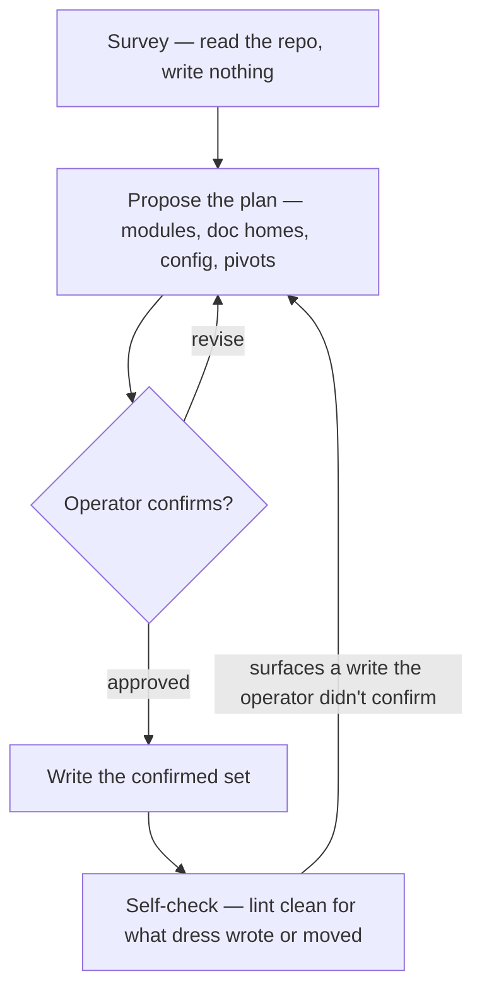

Dress the loom: stand up or re-tune a repo's doc harness by **surveying first, proposing a shape, and writing only what the operator confirms** — so the result is a *coherent* harness the operator chose, not a skeleton imposed on them. The runtime (the SessionStart slicer and the linter) ships with the plugin and runs from `${CLAUDE_PLUGIN_ROOT}`; what this skill writes into the repo is the **docs** plus a small **`.loom/loom.toml`**. Every doc dress writes follows loom's editorial ethos — compression as craft, progressive disclosure, editorial before additive (see [doc-convention](../../references/doc-convention.md)).

**MUST, every run:** survey, then **propose the plan and write nothing until the operator confirms it**; always write `.loom/loom.toml` (the one anchor the runtime trusts); stage, never commit (the operator commits); end lint-clean **for everything dress writes or moves** — pre-existing drift in prose dress leaves untouched is *flagged for `/weft`*, never silently repaired; never strand a cross-reference by a fold or move dress makes; never clobber or invent prose silently. Everything else below is a **DEFAULT** — a shape you *propose*, never impose.

## The spine

There is no separate "blank repo" path — a fresh repo is just a survey that comes back near-empty. Same spine, every time. Every doc-creating action lives in **Write**, downstream of the gate.

### 1. Survey — write nothing

Read the lay of the land before forming an opinion:

- The repo's own override, `.loom/dress.md` if present (relocatable via `[skills] config_dir`): it shapes the DEFAULTs below — it never disables a MUST. See [repo-overrides](../../references/repo-overrides.md).
- Top-level dirs and what each *is*; existing docs and their frontmatter via `bash "${CLAUDE_PLUGIN_ROOT}/scripts/doc-scan"`; code signals for what a module does.
- The live always-on cost: `bash "${CLAUDE_PLUGIN_ROOT}/hooks/doc-slicer"` from the repo root — then **reproduce the rendered slice inline in your message**, not as a bare tool run: tool output collapses in some clients, so the operator never sees what you're asking them to confirm. Quote it with a rough per-slice line/token cost.
- The cross-reference health of the docs you'd adopt: `bash "${CLAUDE_PLUGIN_ROOT}/scripts/doc-linter" --links` — link checks (BROKEN/CODELINK/MISSING) over the whole prospective set, frontmatter-agnostic. Use this, not the plain linter: the plain linter only sees *already-stamped* docs, so on a first dress it reports clean and hides exactly this drift. Whatever it surfaces, fold into the proposal (a repair the operator confirms) or flag for `/weft` — never a surprise repair at self-check. Don't re-implement the link check by hand; this *is* the real rule set.

### 2. Propose — still no writes

Present a concrete plan the operator edits cell by cell. Recommend a core; mark every choice correctable.

- **Modules** — which top-level dirs are modules *and why each is or isn't*. A module owns build/validate concerns; `docs/`, `scripts/`, and vendored dirs usually do not. Propose; never assume top-level = module.
- **Doc homes** — for each doc, whether it is **seeded** (new, from [templates/](templates/)), **mapped** (existing content folded into a home), or **left as a flagged gap** ("backend has no Setup — fill via /weft"). Map existing content; never invent detail to fill a section. `AGENTS.md` (with its `CLAUDE.md` symlink, stamped once via the real file) is a managed `readme` by default — the **agent-facing front door**, from [templates/AGENTS.md](templates/AGENTS.md); loom stamps its own, so the frontmatter block is the convention, not noise.
- **Config** (`.loom/loom.toml`, the small TOML subset documented in [templates/loom.toml](templates/loom.toml)) — the `[context]` slice (`recent_commits`; `slice_headers`, harvested *by header* — path-free, so moving a file never breaks a slice — from **every** managed doc that has that section, the same header across several docs being intended **layering**, not a clash: each contributes its slice under one heading, told apart by its `location` line (e.g. the root README's `## Module Map` lists the top-level modules; a `docs/README.md` `## Module Map` lists the doc subdirs); `inject_fields`) with its token cost; `[lint]` `kinds`/`statuses` mirroring [doc-convention](../../references/doc-convention.md) — the shipped `kinds` are a **floor**, not a fixed set: propose *adding* the kinds the survey shows the repo keeps (a `docs/roadmap.md` ⇒ `roadmap`; how-tos ⇒ `guide`) and dropping any it never uses, rather than leaving the default list untouched; `[discovery] exclude` for trees to drop from the managed set; `[skills] config_dir` to relocate the overrides. **Start from the [template](templates/loom.toml) defaults** — `inject_fields = [updated, kind, location]`, where `location` is the slice's provenance (which doc each harvested section came from); change or drop a default only with a stated reason, never silently.
- **Pivots** — the structural calls that are the operator's, not yours: fold or keep a doc, keep/drop `docs/design` + `docs/diagrams`, the `docs/` location.

### 3. Confirm — the facilitator loop

The operator corrects; re-render the slice and its cost **inline in your message** (never leave it in collapsed tool output); loop until it lands. This loop governs **layout and config alike**, not just `[context]`. If a sliced header is missing, the slicer emits nothing for it — fix the doc with `/weft`, not by working around it here.

### 4. Write — only past the gate

Materialize the confirmed plan as one coherent pass; set every `updated` to today's ISO date.

- Seed a `README.md` **only for a confirmed module (or doc-home like `docs/`) with durable content** — otherwise flag the gap, don't create a hollow file. Absent specific direction a seed **mirrors the reference [template](templates/README.md)**: its headers (`## Overview`, `## Module Map`, …), not invented ones, so it slices correctly by default. Adapt the content to the home and drop sections that don't apply; never redesign the skeleton or rename the harvested `## Module Map` (renaming drops it from the slice).
- Map existing prose into its home — never clobber it, never synthesize detail or elevate voice the operator didn't write.
- Stamp frontmatter with `bash "${CLAUDE_PLUGIN_ROOT}/scripts/doc-stamp" <file> kind=… status=… updated=<today>` — idempotent (sets/replaces the named keys, prepends a block when absent). Never hand-roll an inline shell loop: shell-reserved names like zsh's `status` silently fail the write.
- Always write `.loom/loom.toml` (the MUST anchor).
- Write `.loom/dress.md` **only if the confirmed plan diverges from a DEFAULT** — recording exactly those divergences (`kind: loom-config`), nothing more. No divergence, no override doc.

## Cohesion (the binding invariant)

Propose and write the dependent artifacts as one coherent set so a pivot propagates: module READMEs, `loom.toml`'s enums and slice list, the override doc, the cross-reference web. An entry-point `readme` is at most an optional part of that set — never required, never special. A confirmed pivot updates every dependent in the same pass; never leave a reference pointing at the old shape.

## Red flags

| Thought | Reality |
|---|---|
| "I can see the modules — I'll write their READMEs now." | Propose first. A README is earned by a confirmed module with durable content; nothing is written before the operator confirms. |
| "Fresh repo — I'll just drop the full seed skeleton." | No blank-repo shortcut exists. Survey → propose → confirm → write; the seed is a shape you propose, never a skeleton you impose. |
| "The intro reads better rewritten; this WHY wants a 'The bet' section." | Fold the operator's words into a home; never author or elevate prose they didn't write. |
| "I'll record this decision as an override so it sticks." | Write `dress.md` only for a confirmed divergence from a DEFAULT, and only the divergence — not notes the operator didn't ask for. |
| "It's basically clean; I'll commit the harness." | dress stages; the operator commits. |
| "Lint flags a stale link in a doc I'm adopting — I'll just fix it." | Did *dress* create that link by moving a doc? If not, it's pre-existing drift: flag it for `/weft`, or loop back to propose the repair. Stamping a doc's frontmatter is not license to edit its body. |
| "A second `## Module Map` would double-harvest into the slice — I'll rename it." | That's the layering, not a clash. The slicer stacks each managed doc's section under one heading, told apart by its `location` line — a sub-tree README *should* reuse `## Module Map` (or `## Now`) to contribute its level. Renaming drops it from the slice entirely. |
| "AGENTS.md is harness-loaded root instructions — I'll leave it unmanaged so its frontmatter isn't noise." | No — `AGENTS.md`/`CLAUDE.md` is a managed `readme`, the agent-facing front door (the template ships it that way; loom stamps its own). A 3-line block is the convention, not noise, and leaving it out drops the most important agent-facing doc from the linted set. |
| "This README is thin — an Overview explaining where things live would help." | Thin is the goal. The topology is the explanation; meta-documentation (harness references, routing narration) is the slop the `meta_denylist` lint trips on. Seed the map, not a legend about maps. |

## Self-check

End by running `bash "${CLAUDE_PLUGIN_ROOT}/scripts/doc-linter"`. **Clean means everything dress wrote or moved is coherent** — the frontmatter it stamped, the config it wrote, every reference it folded or relocated — which also proves *that* cross-reference web is sound. A finding inside dress's own work: fix it, it's part of the confirmed pass. A finding in prose dress left untouched is **pre-existing drift the survey already surfaced** — flag it for `/weft`, never silently repair it. If such a fix genuinely belongs in this pass, loop back to **propose** it (the back-edge) and let the operator confirm; never reach past the gate to edit a body that wasn't in the plan.

## Output

Report the confirmed plan (modules, doc homes, config, pivots), what was seeded vs. mapped vs. flagged as a gap, the `loom.toml` written, the `dress.md` if a divergence warranted one, gaps flagged for `/weft`, and the clean lint run.
