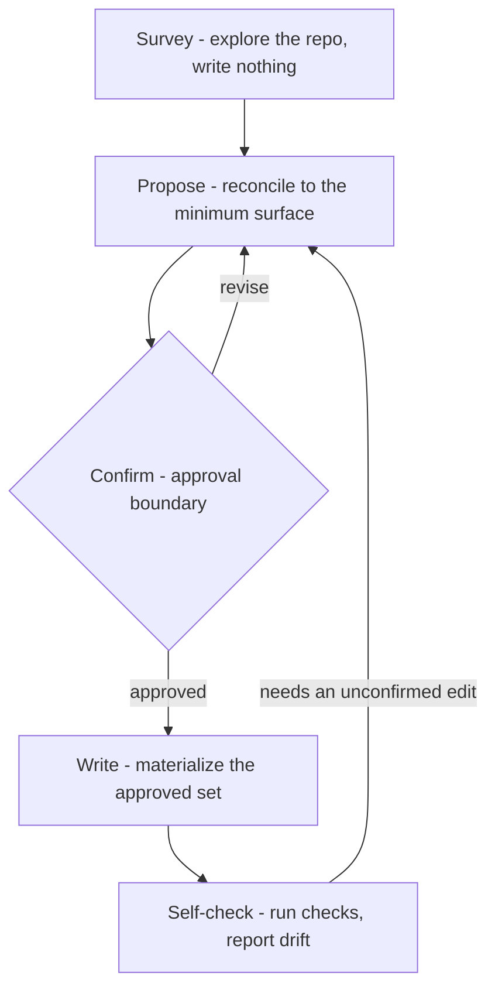

## Dress

Install or retune loom for a repo. dress decides the repo-local control surfaces: `.loom/loom.toml`, optional `.loom/<skill>.md` overrides, managed docs, and `.loom/scripts/` hooks. The plugin supplies the runtime (`doc-scan`, `doc-slicer`, `doc-linter`, `doc-stamp`, `skill-hook`); dress configures what that runtime sees.

`dress` handles three repo states:

- **Blank/new:** little structure exists; propose the smallest useful loom surface.
- **Undressed existing:** code/docs exist but `.loom/loom.toml` does not; map existing material before seeding anything.
- **Dressed:** `.loom/loom.toml` exists; read current config and overrides, then propose retuning instead of reinstalling.

## Dress Control Surfaces

These are the surfaces `dress` reads or writes directly. The full `.loom/loom.toml` key map lives in the reference project, which the Propose step loads explicitly.

| Surface | Dress uses it for |
|---|---|
| `.loom/loom.toml` | read existing config; propose or write the repo control plane |
| `.loom/<skill>.md` | read existing repo opinion; propose only when a skill needs repo-specific guidance |
| `.loom/scripts/*` | detect or scaffold approved deterministic hook scripts |
| managed Markdown/frontmatter | adopt, seed, move, exclude, or stamp docs in the managed set |

## Workflow Graph



## Workflow

### 1. Survey - explore the repo, write nothing

Determine whether this repo is blank, undressed, or already dressed, then gather only the facts needed to propose the surface.

- Check `.loom/`: whether `.loom/loom.toml` exists, which `.loom/<skill>.md` overrides exist, and whether hook scripts already exist under `.loom/scripts/`.
- Run `bash "${CLAUDE_PLUGIN_ROOT}/scripts/doc-scan"` to see what loom currently sees: the managed docs and the frontmatter-less candidates.
- Run `bash "${CLAUDE_PLUGIN_ROOT}/scripts/doc-slicer"` to see the current startup slice.
- Inspect only enough repo shape to explain the proposal: modules, build/test signals, existing docs worth mapping, and obvious gaps.

### 2. Propose - reconcile to the minimum surface

Review the reference project as calibration for the minimum loom surface, then turn the survey into an adoption diff: current state -> needed loom surface -> proposed changes. Still write nothing.

```bash
cat "${CLAUDE_PLUGIN_ROOT}/references/reference-project.md"
```

- **Control plane.** Always propose `.loom/loom.toml`; say whether it is new or a retune, and whether an existing one is valid.
- **Managed set.** For existing Markdown, say adopt, leave unmanaged, exclude, move, or seed. `AGENTS.md` is the default agent-facing `readme`; seed only durable content.
- **Startup slice.** Propose `context.slice_headers` and `context.inject_fields` from headings that exist or docs you propose to create.
- **Overrides.** Propose `.loom/<skill>.md` only for repo opinion that changes a skill's DEFAULT behavior.
- **Hooks/scripts.** Propose scripts only for deterministic behavior.
- **Gaps.** Name what loom needs but the repo does not yet know. Do not fill unknowns with invented prose.

### 3. Confirm - approval boundary

Do not write until the operator approves the exact adoption diff. If the operator changes scope, revise the proposal first. Approval covers the docs, config, overrides, scripts, moves, excludes, and staged files for this pass.

### 4. Write - materialize the approved set

Write one coherent pass from the approved diff.

- Always write or update `.loom/loom.toml`.
- Adopt, move, seed, or exclude only the approved docs.
- Preserve operator voice when mapping existing prose.
- Stamp managed docs with `bash "${CLAUDE_PLUGIN_ROOT}/scripts/doc-stamp" <file> kind=... status=... updated=<today>`.
- Stage only approved files changed by dress.

### 5. Self-check - run checks, report drift

Run `bash "${CLAUDE_PLUGIN_ROOT}/scripts/doc-linter"`. Fix findings caused by the approved dress work. Report unrelated drift separately. If the fix requires an unapproved change, return to Propose.

## Output

Report what changed, what was staged, what gaps remain, and the self-check result.
