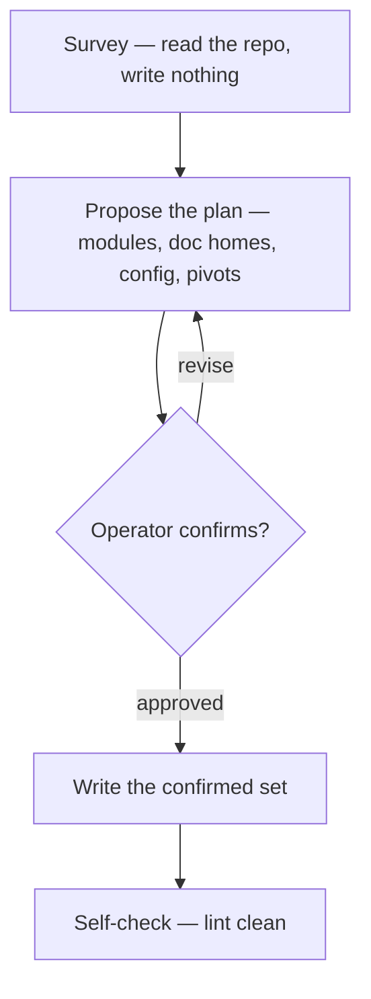

Dress the loom: stand up or re-tune a repo's doc harness by **surveying first, proposing a shape, and writing only what the operator confirms** — so the result is a *coherent* harness the operator chose, not a skeleton imposed on them. The runtime (the SessionStart slicer and the linter) ships with the plugin and runs from `${CLAUDE_PLUGIN_ROOT}`; what this skill writes into the repo is the **docs** plus a small **`.loom/loom.toml`**. Every doc dress writes follows loom's editorial ethos — compression as craft, progressive disclosure, editorial before additive (see [doc-convention](../../references/doc-convention.md)).

**MUST, every run:** survey, then **propose the plan and write nothing until the operator confirms it**; always write `.loom/loom.toml` (the one anchor the runtime trusts); stage, never commit (the operator commits); end lint-clean; never leave a cross-reference pointing at an old shape; never clobber or invent prose silently. Everything else below is a **DEFAULT** — a shape you *propose*, never impose.

## The spine

There is no separate "blank repo" path — a fresh repo is just a survey that comes back near-empty. Same spine, every time. Every doc-creating action lives in **Write**, downstream of the gate.

### 1. Survey — write nothing

Read the lay of the land before forming an opinion:

- The repo's own override, `.loom/dress.md` if present (relocatable via `[skills] config_dir`): it shapes the DEFAULTs below — it never disables a MUST. See [repo-overrides](../../references/repo-overrides.md).
- Top-level dirs and what each *is*; existing docs and their frontmatter via `bash "${CLAUDE_PLUGIN_ROOT}/scripts/doc-scan"`; code signals for what a module does.
- The live always-on cost: `bash "${CLAUDE_PLUGIN_ROOT}/hooks/doc-slicer"` from the repo root — show the operator the actual slice with a rough per-slice line/token cost.

### 2. Propose — still no writes

Present a concrete plan the operator edits cell by cell. Recommend a core; mark every choice correctable.

- **Modules** — which top-level dirs are modules *and why each is or isn't*. A module owns build/validate concerns; `docs/`, `scripts/`, and vendored dirs usually do not. Propose; never assume top-level = module.
- **Doc homes** — for each doc, whether it is **seeded** (new, from [templates/](templates/)), **mapped** (existing content folded into a home), or **left as a flagged gap** ("backend has no Setup — fill via /weft"). Map existing content; never invent detail to fill a section.
- **Config** (`.loom/loom.toml`, the small TOML subset documented in [templates/loom.toml](templates/loom.toml)) — the `[context]` slice (`recent_commits`; `slice_headers`, harvested *by header* so moving a file never breaks a slice; `inject_fields`) with its token cost; `[lint]` `kinds`/`statuses` mirroring [doc-convention](../../references/doc-convention.md); `[discovery] exclude` for trees to drop from the managed set; `[skills] config_dir` to relocate the overrides.
- **Pivots** — the structural calls that are the operator's, not yours: fold or keep a doc, keep/drop `docs/design` + `docs/diagrams`, the `docs/` location.

### 3. Confirm — the facilitator loop

The operator corrects; re-render the slice and its cost; loop until it lands. This loop governs **layout and config alike**, not just `[context]`. If a sliced header is missing, the slicer emits nothing for it — fix the doc with `/weft`, not by working around it here.

### 4. Write — only past the gate

Materialize the confirmed plan as one coherent pass; set every `updated` to today's ISO date.

- Seed a module `README.md` **only for a confirmed module with durable content**; otherwise flag the gap rather than create a hollow file.
- Map existing prose into its home — never clobber it, never synthesize detail or elevate voice the operator didn't write.
- Always write `.loom/loom.toml` (the MUST anchor).
- Write `.loom/dress.md` **only if the confirmed plan diverges from a DEFAULT** — recording exactly those divergences (`kind: loom-config`), nothing more. No divergence, no override doc.

## Cohesion (the binding invariant)

Propose and write the dependent artifacts as one coherent set so a pivot propagates: module READMEs, `loom.toml`'s enums and slice list, the override doc, the cross-reference web. An entry-point `readme` is at most an optional part of that set — never required, never special. A confirmed pivot updates every dependent in the same pass; never leave a reference pointing at the old shape.

## Red flags

| Thought | Reality |
|---|---|
| "I can see the modules — I'll write their READMEs now." | Propose first. A README is earned by a confirmed module with durable content; nothing is written before the operator confirms. |
| "Fresh repo — I'll just drop the full seed skeleton." | No blank-repo shortcut exists. Survey → propose → confirm → write; the seed is a shape you propose, never a skeleton you impose. |
| "The intro reads better rewritten; this WHY wants a 'The bet' section." | Fold the operator's words into a home; never author or elevate prose they didn't write. |
| "I'll record this decision as an override so it sticks." | Write `dress.md` only for a confirmed divergence from a DEFAULT, and only the divergence — not notes the operator didn't ask for. |
| "It's basically clean; I'll commit the harness." | dress stages; the operator commits. |

## Self-check

End by running `bash "${CLAUDE_PLUGIN_ROOT}/scripts/doc-linter"` — the harness is born lint-clean, which also proves the cross-reference web is coherent.

## Output

Report the confirmed plan (modules, doc homes, config, pivots), what was seeded vs. mapped vs. flagged as a gap, the `loom.toml` written, the `dress.md` if a divergence warranted one, gaps flagged for `/weft`, and the clean lint run.
