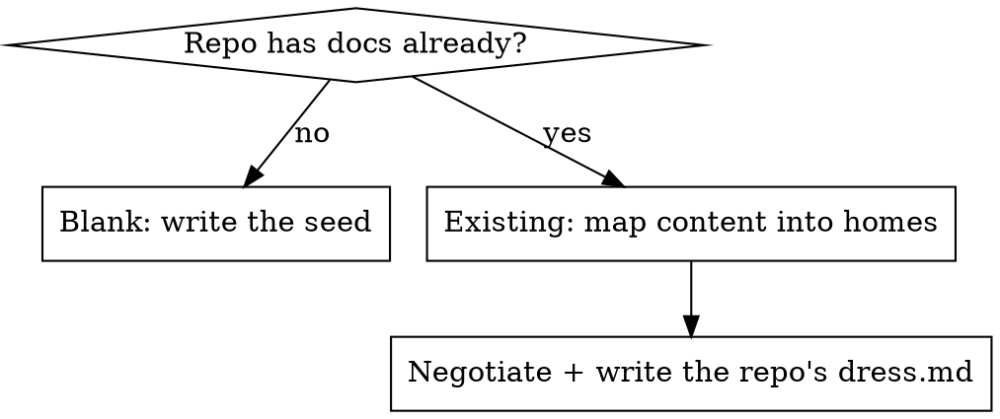

Dress the loom: stand up or re-tune the doc harness conversationally — explaining each artifact as it lands and letting the operator pivot — so the result is a *coherent* harness, not just files. `docs/README.md` is the source of truth for what docs mean in this repo; everything else implements it. The runtime (the SessionStart slicer and the linter) ships with the plugin and runs from `${CLAUDE_PLUGIN_ROOT}`; what this skill writes into the repo is the **docs** plus a small **`docs/config/loom.toml`**.

**MUST, every run:** stage, never commit (the operator commits); write `docs/config/loom.toml` (the one invariant anchor the runtime trusts); end lint-clean; never leave a cross-reference pointing at an old shape; on an existing repo, never clobber existing prose silently. Everything else below is a **DEFAULT** — a seed you may reshape.

## Load the repo's opinion first

Read `docs/config/loom/dress.md` if it exists (relocatable via `[skills] config_dir`) and let it shape the DEFAULT layout and seeds below — which headers are canonical, which dirs are modules, what counts as scaffolding. It shapes; it never disables a MUST. See [repo-overrides](../../references/repo-overrides.md).

## Fresh vs. existing

- **Blank repo (DEFAULT seed).** Copy the seeds from [templates/](templates/) — `README.md`, `AGENTS.md` (with a `CLAUDE.md` symlink), a `module-README.md` per module, `docs-README.md`, `loom.toml`, and the `dress.md` override stub. Fill the `<…>` placeholders; set every `updated` to today's ISO date. Prompt for the identity one-liner and the module list. The seed is a starting shape, not law.
- **Existing repo.** Inventory what's there and **map content into homes** rather than overwrite: fold an existing intro into the repo's own Overview, derive the module map from real top-level dirs, fill module Overviews from code where obvious, and **flag gaps** ("backend has no Setup — fill via /weft") instead of inventing detail. Where the repo diverges from the seed — different canonical headers, a flat layout, extra scaffolding — record that in `docs/config/loom/dress.md` so future runs honor it. Never clobber existing prose silently.

## The config: `docs/config/loom.toml`

`loom.toml` is what the runtime reads — there is no per-repo code to edit. It is a small TOML subset (`[table]` headers, `key = scalar`, single-line `key = ["arrays"]`). The seed at [templates/loom.toml](templates/loom.toml) documents every table; fill it from the chosen structure rather than restating the schema:

- `[context]` — what the SessionStart hook injects (`recent_commits`; `slice_headers`, harvested *by header* so moving a file never breaks a slice; `inject_fields`). Start maximal, then trim *down* — the slice is paid every session.
- `[lint]` — `kinds` / `statuses`, mirroring the Nomenclature in `docs/README.md`. `kinds` is also the discovery key.
- `[discovery]` — `exclude` drops a tree from the managed set entirely; `scaffolding` keeps it a candidate but tells the skills not to pester about adopting it.
- `[skills]` — `config_dir` relocates the per-skill override docs (default `docs/config/loom`).

## Re-tune (the facilitator loop)

To adjust what loads or what the linter enforces:

1. Render the live context: `bash "${CLAUDE_PLUGIN_ROOT}/hooks/doc-slicer"` from the repo root, and show the operator the actual output with a rough per-slice line/token cost so the always-on tax is visible.
2. Tune `[context]` / `[lint]` / `[discovery]` with the operator — add/drop/reorder `slice_headers`, adjust `inject_fields`, match enums to `docs/README.md`, exclude or mark-scaffolding the trees that shouldn't be managed. Re-render, re-show. Loop until it lands.
3. If a sliced header is missing, the slicer emits nothing for it — fix the doc with `/weft`, not by working around it here.

## Cohesion (the binding invariant)

Generate every dependent artifact *from* `docs/README.md` so a pivot propagates: module READMEs, `loom.toml`'s enums and slice list, the override docs. Offer pivots (which dirs are modules, keep/drop `docs/design` + `docs/diagrams`, the `docs/` location) and recommend a core — but never leave a reference pointing at the old shape.

## Self-check

End by running `bash "${CLAUDE_PLUGIN_ROOT}/scripts/doc-linter"` — the scaffold is born lint-clean, which also proves the cross-reference web is coherent.

## Red flags

| Thought | Reality |
|---|---|
| "This repo obviously wants the canonical layout — skip the negotiation." | The seed is a DEFAULT. An existing repo gets its content mapped and its own `dress.md`, never the seed imposed. |
| "I'll just overwrite the stale README intro." | Never clobber existing prose silently — fold it into a home, or flag the gap. |
| "It's basically clean; I'll commit the scaffold." | dress stages; the operator commits. |

## Output

Report what was scaffolded vs. mapped from existing content, the pivots chosen, the `loom.toml` written, the repo's `dress.md` if one was written, gaps flagged for `/weft`, and the clean lint run.
