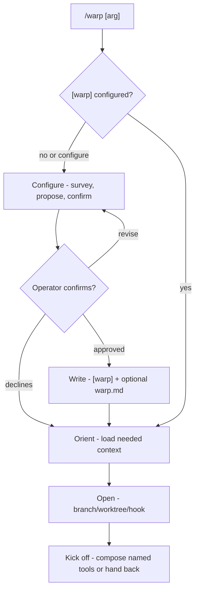

## Warp 

Open a unit of work. warp orients the session, establishes the branch/worktree when configured, runs an optional open hook, and hands back ready to work. It never commits and never writes session docs; close-out and durable distillation belong to weave.

`warp` handles two repo states:

- **Unconfigured:** no `[warp]` section exists in `.loom/loom.toml`; configure the flow or orient only.
- **Configured:** `[warp]` section exists in `.loom/loom.toml`; run the confirmed flow and stop only for real session unknowns or git safety.

## loom.toml Control Surfaces

| Surface | Controls | Used by |
|---|---|---|
| `[warp].branch_convention` | session-open branch naming pattern, or `ask` | `warp` |
| `[warp].worktree` | worktree behavior: `always`, `never`, `ask`, or `harness` | `warp` |
| `[warp].source_repo` | local path or GitHub ref used to interpret `/warp <arg>` | `warp` |
| `[warp].source_branch` | base branch new work forks from | `warp` |
| `[warp].hook` | optional session-open command | `warp`, `skill-hook` |
| `.loom/warp.md` | repo opinion for orientation, workspace setup, and kickoff | `warp` |
| `.loom/scripts/*` | conventional home for hook scripts | configured hooks |

## Workflow Graph

## Workflow

### 1. Configure - approval boundary

Use only on first run, missing `[warp]`, or `/warp configure`.

- Survey how the repo opens work: branch names, source branch, worktree habit, ticket refs, existing `.loom/warp.md`, and open scripts.
- Propose the `[warp]` knobs and any `.loom/warp.md` repo opinion.
- Write nothing until the operator approves the exact diff.
- If the operator declines, write nothing and continue to Orient only.

### 2. Orient - load enough context

- Read `.loom/warp.md` if present.
- Treat the SessionStart slice as already loaded; pull extra sections with `bash "${CLAUDE_PLUGIN_ROOT}/scripts/doc-slicer" --header "<name>" [path-filter]`.
- Resolve `/warp <arg>` through `source_repo`: GitHub ref means fetch the issue/PR; local path means free-text work description; no arg means ask only if needed.
- Do not mutate the workspace before orientation.

### 3. Open - establish the workspace

- If `[warp] hook` is set, run `bash "${CLAUDE_PLUGIN_ROOT}/scripts/skill-hook" warp "<slug>"`.
- Hook exit `0`: verify the working directory and continue.
- Hook exit `3`: no hook; open by hand.
- Other hook exit: surface the failure, then fall back to the prose floor unless git safety blocks.
- Manual open: name the branch from `branch_convention`, branch from `source_repo` / `source_branch`, and apply `worktree`.
- `worktree = always|ask` means the session works inside the worktree; verify `pwd` before the first edit.
- `worktree = harness` delegates worktree creation to the host harness; a hook there handles only residual setup.
- Never discard, stash, switch away from, or move uncommitted work without confirmation.

### 4. Kick off - compose or hand back

Compose only what `.loom/warp.md` names: a brainstorm, plan, code pass, or no tool at all. If a named tool is absent, say so and continue with an oriented workspace.

## Red flags

| Thought | Reality |
|---|---|
| "No config; I'll pick sensible defaults and go." | Configure is a propose -> confirm pass, or warp only orients. |
| "`[warp]` is set; I'll re-confirm everything." | Run-mode is lean. Stop only for session unknowns or git safety. |
| "The named kickoff tool is missing; I'll substitute another." | Compose only what was named. If absent, report it and continue. |
| "I'll write down the session intent." | warp writes no session docs. weave handles durable close-out. |
| "The hook failed, so warp failed." | Hook failure falls back to prose unless workspace safety blocks. |
| "The worktree exists, so I can edit." | Verify the session is inside the worktree before editing. |
| "Dirty work can be stashed automatically." | Any move of uncommitted work needs confirmation. |

## Output

Report the oriented work, loaded context, branch/worktree and verified working directory, hook result, kickoff action or handback, and any named tool that was unavailable. In configure mode, report the `[warp]` knobs and `.loom/warp.md` changes. warp never commits.
