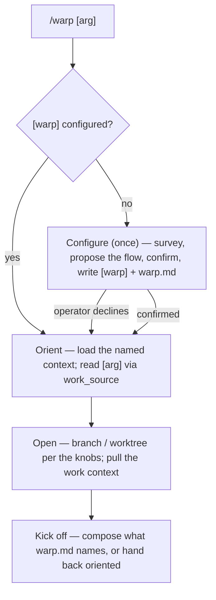

Open a unit of work: orient the session, set up the workspace, and hand off ready to build. warp is the session-*open* bookend to `/weft` (session close) — where weft distills landed work and closes the branch, warp **opens**. It **never commits and never journals the session** — git is the activity log, and the durable doc-writing happens at close, in weft. Any prose warp does write — chiefly its `.loom/warp.md` nudge — follows loom's editorial ethos (see [doc-convention](../../references/doc-convention.md)).

warp is invoked whenever you open real work — often, but never automatically; a quick question or a no-branch edit can skip it. Because it's the common-case opener, the spine stays thin and the friction near-zero: the confirmation lives in a one-time **configure** pass, and after that warp **runs** the flow you already approved without re-litigating each step.

warp is **mostly REPO OPINION**, split across loom's two planes:

- **`loom.toml [warp]` — the control plane (enforced).** The mechanical knobs the runtime acts on: `branch_convention` (naming pattern, e.g. `"feature/<slug>"`, or `"ask"`), `worktree` (`"always"`|`"never"`|`"ask"` — `always`/`ask` mean the session *works inside* the worktree, not merely that one exists), `work_source` (where work items come from and how `/warp <arg>` is read — e.g. `"github"`, `"jira"`, `"none"`). When the section is present the linter **requires** these and validates them, so run-mode can trust them without re-asking.
- **`.loom/warp.md` — the prose plane (suggestion).** One freeform nudge — *how we open work here*: what to review (the roadmap? which module docs?), what to kick off (a brainstorm? straight to code?), the working patterns to honor. warp reads and follows it; it never has to exist.

**MUST:** orient before mutating the workspace; in **configure** mode, propose the flow and **write neither config nor workspace until the operator confirms** (the symmetric twin of weft's "never merge without opt-in"); in **run** mode, execute the confirmed flow and **stop only for genuine per-session unknowns and destructive-git safety** — never discard or move uncommitted work to branch/switch without confirmation; **never commit, and never journal the session** — git is the activity log; durable doc-writing is weft's job at close. Everything the flow *does* between those rails is **DEFAULT / REPO OPINION**, shaped by `[warp]` and `.loom/warp.md`. Assume no specific skills exist: compose only what the config names, and when a named tool is absent, **say so and continue** — never hard-fail an open.

## Load the repo's opinion first

Read `.loom/warp.md` if it exists (relocatable via `[skills] config_dir`); it shapes orientation, kickoff, and working patterns. It never relaxes a MUST. See [repo-overrides](../../references/repo-overrides.md).

## The spine

### Configure — the rare setup pass

First run on a repo (no `[warp]` section), or `/warp configure` to re-tune — the same survey → propose → confirm → write spine `/dress` uses for the harness. Survey how the repo already opens work — branch names in `git log`, whether worktrees are in use, any ticket refs — then **propose** the knobs and the prose nudge as a plan the operator edits cell by cell. Write `[warp]` into `.loom/loom.toml` and the nudge into `.loom/warp.md` (`kind: loom-config`) **only past the operator's confirm**. If the operator declines to configure, skip to a minimal orient and hand back — never write a half-specified flow.

### Run — the lean pass

With `[warp]` present, execute the confirmed flow and prompt only where you genuinely must:

1. **Orient.** Read `.loom/warp.md` and load the context it names (the SessionStart slice is already loaded). Resolve `/warp <arg>` through `work_source`: a ticket ref → fetch it; free text → the work's description; nothing → ask, or orient only.
2. **Open the workspace.** Name the branch per `branch_convention` (prompt iff it's `ask` or the slug is ambiguous); set up the worktree per `worktree`, at whatever path/home `.loom/warp.md` names. `worktree = always|ask` means the session **works inside** the worktree, not merely that one exists on disk — after creating it, switch the session in and verify the working directory before the first edit. If the session can't move in, surface it and stop rather than editing the base branch. Never overwrite uncommitted work to do either without confirming.
3. **Kick off.** Compose what `.loom/warp.md` names — a brainstorm, a plan, straight to code — or simply hand back an oriented session. Compose by name; if the named tool isn't available, note it and continue.

## Red flags

| Thought | Reality |
|---|---|
| "First run, no config — I'll pick sensible branch/worktree defaults and go." | Configure is a propose→confirm pass. warp writes no config and mutates no workspace until the operator confirms the flow — or declines, and warp just orients. |
| "`[warp]` is set, but I'll re-confirm each step to be safe." | Run-mode is lean by design; the confirm already happened at configure-time. Stop only for per-session unknowns and destructive-git safety. |
| "The config names a brainstorm skill that isn't installed — I'll substitute my own." | Compose only what's named. If it's absent, say so and continue (hand back oriented); don't silently swap in something the operator didn't choose. |
| "I'll jot the session's intent into a doc so it's captured." | warp writes no session doc. git is the activity log; `/weft` distills at close. |
| "There's uncommitted work but the flow says new branch — I'll stash and switch." | Destructive-git safety: never discard or move uncommitted work to open. Surface it and confirm first. |
| "Worktree's created — I'll start editing." | A worktree on disk isn't an entered worktree — the session can still be in the original checkout (the base branch). `worktree` isn't honored until the session works inside it; verify the working directory before the first edit. |

## Output

Report what was oriented (the work named, the context loaded), the workspace set up (branch, worktree), what was kicked off (or that warp handed back), and anything a named-but-absent tool forced it to skip. In configure mode, report the `[warp]` knobs and `.loom/warp.md` written. warp never commits.
