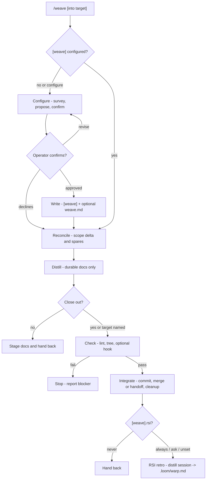

## Weave

Close out a unit of work. weave scopes the session delta, distills durable change into the managed docs, runs the close-out checks and optional close hook, then hands back or integrates when explicitly requested. It is the session-close bookend to warp.

`weave` handles two repo states:

- **Unconfigured:** no `[weave]` section exists in `.loom/loom.toml`; configure the flow or distill and stage only.
- **Configured:** `[weave]` section exists in `.loom/loom.toml`; run the confirmed flow and stop only for real close-out unknowns, check failures, or git safety.

## Weave Control Surfaces

These are the surfaces `weave` reads or writes directly. The full `.loom/loom.toml` key map lives in the reference project.

| Surface | Weave uses it for |
|---|---|
| `[weave].cleanup` | merged branch cleanup: `always`, `never`, or `ask` |
| `[weave].rsi` | end-of-session retro filed to `.loom/warp.md`: `always`, `ask`, `never` (default on) |
| `[weave].hook` | optional session-close command, run via `skill-hook` |
| `.loom/weave.md` | repo opinion for distillation, pruning, and close-out convention |
| `.loom/scripts/*` | conventional home for hook scripts |

## Workflow Graph

## Workflow

### 1. Configure - approval boundary

Use only on first run, missing `[weave]`, or `/weave configure`.

- Survey how this repo closes work: target branch, merge vs PR handoff, branch cleanup, docs that usually move, existing `.loom/weave.md`, and close scripts.
- Propose the `[weave]` knobs and any `.loom/weave.md` repo opinion.
- Write nothing until the operator approves the exact diff.
- If the operator declines, write no config and continue to Reconcile only.

### 2. Reconcile - scope the session

- Read `.loom/weave.md` if present.
- Scope the work against the branch base: `git log`, `git diff <base>..HEAD`, and `git status --porcelain`.
- Run `bash "${CLAUDE_PLUGIN_ROOT}/scripts/doc-scan"` and resolve markdown spares: distill, adopt, exclude, or leave for a named follow-up.
- Pull sections with `bash "${CLAUDE_PLUGIN_ROOT}/scripts/doc-slicer" --header "<name>" [path-filter]`; read whole files only when rewriting them.
- Do not move, drop, stash, or hide uncommitted work without confirmation.

### 3. Distill - durable docs only

- Write only durable signal: current behavior, decisions that change future action, setup/validation facts, and doc routing.
- Preserve operator voice and prune task-local status, ordinary history, duplicate explanation, and prose now owned by a hook or script.
- Stamp managed docs with `bash "${CLAUDE_PLUGIN_ROOT}/scripts/doc-stamp" <file> kind=... status=... updated=<today>`.
- Run `bash "${CLAUDE_PLUGIN_ROOT}/scripts/doc-linter"` and fix findings caused by the weave work.
- Stage the doc/config diff. Plain `/weave` stops here unless the operator opts into close-out.

### 4. Check - before integration

- Run `bash "${CLAUDE_PLUGIN_ROOT}/scripts/doc-linter"`.
- Ensure `git status --porcelain` is resolved: every untracked, modified, or deleted file is staged or explicitly explained.
- If `[weave] hook` is set, run `bash "${CLAUDE_PLUGIN_ROOT}/scripts/skill-hook" weave`.
- Hook exit `0`: continue.
- Hook exit `3`: no hook; continue on the built-in checks.
- Other hook exit: stop and report the close hook failure.

### 5. Integrate - only on opt-in

- Commit the staged weave diff only when close-out is requested.
- If invoked as `/weave into <target>`, use that target; otherwise ask before merge/PR handoff.
- Local integration uses a written `--no-ff` merge commit unless the repo opinion says to hand off by PR.
- Apply `[weave].cleanup`: delete the merged branch when `always`, keep it when `never`, ask when `ask`.
- Never remove worktrees; report any cleanup the harness or operator must finish.

### 6. RSI - session retro (gated by `[weave].rsi`)

At close-out, run the retro when `[weave].rsi` is `always` or unset (the default is on), or `ask` (confirm first); skip on `never`.

- Look back over the session: where it snagged (failed calls, retries, denials, serialized waits, discovery loops), what context, hooks, and overrides helped, and what got in the way.
- Distill that into a handful of concrete, forward-looking experiments to try next session — testable nudges, not a session log.
- Append them under an `## Experiments` heading in `.loom/warp.md` so the next `/warp` picks them up. Create the file (`kind: loom-config`, stamped today) if it does not exist; never overwrite warp's existing repo opinion.
- Keep it to signal. If nothing durable surfaced, say so and write nothing.

## Output

Report the scoped delta, spares resolved, docs/config changed with one-line rationales, hook and check results, staged files, any close-out action taken, and the retro experiments filed to `.loom/warp.md`, if any. If nothing durable changed, say so and make no edit.
