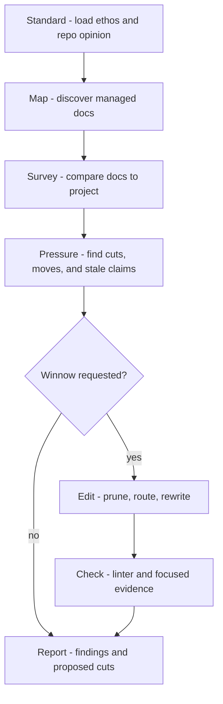

## Weft

Run a project-documentation editorial pass. weft reads the managed docs as one surface, compares them to the project they claim to describe, then cuts, routes, or rewrites until the set is lean, durable, and useful to a future agent or human.

`weft` handles two operator intents:

- **Review:** report the weak spots and proposed cuts; edit nothing.
- **Winnow:** make one coherent editorial pass, then validate.

## Weft Control Surfaces

`weft` has no `.loom/loom.toml` section. It uses loom's discovered managed set and the shared editorial standard.

| Surface | Weft uses it for |
|---|---|
| `${CLAUDE_PLUGIN_ROOT}/references/doc-convention.md` | the editorial standard: durable signal, routing, compression, determinism over prose |
| `README.md` / `AGENTS.md` | the project's front doors and tone anchors |
| `bash "${CLAUDE_PLUGIN_ROOT}/scripts/doc-scan"` | the managed docs and unmanaged candidates |
| `bash "${CLAUDE_PLUGIN_ROOT}/scripts/doc-linter"` | mechanical findings before and after edits |
| `.loom/weft.md` | optional repo opinion for local voice, known stale areas, or stricter taste |
| project tree and code signals | evidence that a doc is true, stale, misplaced, or needless |

## Workflow Graph

## Workflow

### 1. Standard - load the taste

- Read `${CLAUDE_PLUGIN_ROOT}/references/doc-convention.md`, root `README.md`, and `AGENTS.md` when present.
- Read `.loom/weft.md` if present.
- Hold the pass to the loom standard: docs orient and route; code is the road; thin is often correct.
- Treat "true" as insufficient. A sentence must be durable, placed well, and change the reader's next action.

### 2. Map - find the documentation surface

- Run `bash "${CLAUDE_PLUGIN_ROOT}/scripts/doc-scan"` and `bash "${CLAUDE_PLUGIN_ROOT}/scripts/doc-linter"` first.
- Use the managed set as the review scope. Candidates are not part of the pass unless they explain an omission or should be adopted/excluded.
- Read every managed doc in the pass. For large repos, batch by role: front doors first, then module docs, then references/specs/plans by kind.
- Inspect enough project shape to verify the docs: top-level tree, module boundaries, commands, tests, package files, and code areas named by the docs.

### 3. Pressure - identify editorial debt

Look for text that fails the project, not text that merely could be prettier.

- **Not durable:** session notes, pending chatter, ordinary history, emotional scaffolding, task-local explanations.
- **Not routed:** duplicate facts, index sprawl, repeated setup, details living in a front door that should link deeper.
- **Not current:** commands, module names, package facts, architecture claims, or roadmap focus contradicted by the tree.
- **Not useful:** prose that restates file structure, narrates loom, explains the obvious, hedges, decorates, or summarizes without changing action.
- **Not prose's job:** deterministic steps that should be scripts, hooks, tests, lint, or config.

### 4. Edit - cut before adding

If the operator asked for a review, stop with findings and proposed cuts. If they asked to winnow, make the pass.

- Prefer deletion, routing, or compression over new explanation.
- Preserve the operator's voice; reduce the agent's fingerprints.
- Move facts to the one home a reader would expect, then link rather than repeat.
- Keep front doors short: purpose, map, validation, and the next useful route.
- Leave a doc skeletal when the structure is useful; delete or propose deletion when the doc no longer has a job.
- Stamp changed managed docs with `bash "${CLAUDE_PLUGIN_ROOT}/scripts/doc-stamp" <file> kind=... status=... updated=<today>`.

### 5. Check - prove the pass did not create drift

- Run `bash "${CLAUDE_PLUGIN_ROOT}/scripts/doc-linter"`.
- Re-check any factual claims touched by the edit against the project tree or source named by the doc.
- Do not commit, merge, or close out. weave owns session close-out.
- If a needed cut is risky because the fact may matter, report the uncertainty rather than padding around it.

## Red flags

| Thought | Reality |
|---|---|
| "This is true, so keep it." | Truth is table stakes. Keep only durable, placed, action-changing truth. |
| "The README should explain the whole system." | A front door routes. Details live where work happens. |
| "The docs feel thin." | Thin is healthy when the map is clear and the code carries detail. |
| "I'll add a clarifying paragraph." | First try deleting, linking, moving, or naming the actual command. |
| "This should describe how loom works." | Repo docs describe the project. loom mechanics stay in the plugin or `.loom/<skill>.md`. |
| "I need to refactor the code to fix the docs." | weft edits docs. Name code follow-up only when needed to resolve a documented lie. |

## Output

Report the managed docs reviewed, the evidence used to check them, the cuts/moves/rewrites made or proposed, validation results, and any remaining stale claims or adoption/exclusion candidates. If no edit survives the standard, say so and leave the docs untouched.
