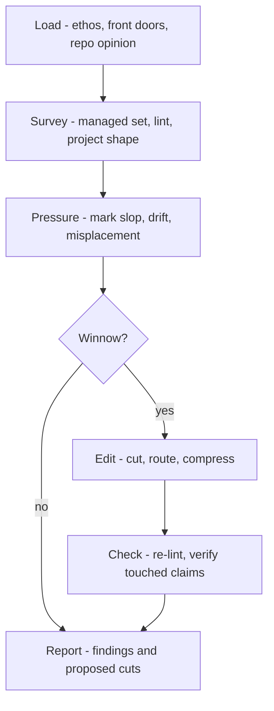

## Weft

Run a project-documentation editorial pass. weft reads the managed docs as one surface, holds them against the [editorial ethos](../../references/doc-convention.md) and the project they claim to describe, then cuts, routes, and compresses until the set is lean, durable, and useful.

weft is subtractive by default: it removes slop, dedupes, and moves each fact to its one home before it writes any new prose. It edits docs only — it never commits or closes out (weave owns that), and it describes the *project*, never loom's mechanics.

`weft` handles two operator intents:

- **Review:** report the weak spots and proposed cuts; edit nothing.
- **Winnow:** make one coherent editorial pass, then re-check.

## Weft Control Surfaces

weft has no `.loom/loom.toml` section. Its standard is the shared ethos, its checks are the runtime scripts, and its scope is loom's discovered managed set.

| Surface | Weft uses it for |
|---|---|
| [editorial ethos](../../references/doc-convention.md) | the standard every cut is judged against: durable signal, one home, compression, determinism over prose |
| `doc-scan` / `doc-linter` | the managed set and the mechanical findings, before and after edits |
| `README.md` / `AGENTS.md` | the project's front doors and voice anchors |
| `.loom/weft.md` | optional repo opinion: local voice, known-stale areas, stricter taste |
| project tree and code | evidence that a doc is true, stale, misplaced, or needless |

## Workflow Graph



## Workflow

### 1. Load - the standard and the voice

Load the ethos weft enforces, the front doors it must preserve, and any repo opinion:

```bash
cat "${CLAUDE_PLUGIN_ROOT}/references/doc-convention.md"
cat README.md AGENTS.md .loom/weft.md 2>/dev/null
```

Hold the pass to that standard: docs orient and route, code is the road, thin is often correct. A sentence earns its place only if it is durable, well-placed, and changes the reader's next action — "true" is not enough.

### 2. Survey - see the real doc set

```bash
bash "${CLAUDE_PLUGIN_ROOT}/scripts/doc-scan"
bash "${CLAUDE_PLUGIN_ROOT}/scripts/doc-linter"
```

The managed set is the review scope; a candidate enters only if it explains an omission or should be adopted or excluded. Read every managed doc — for large repos, batch by role: front doors, then module docs, then references. Inspect enough project shape (tree, module boundaries, commands, tests) to tell truth from claim.

### 3. Pressure - find what fails the project

Mark text that fails the doc's job, not text that could merely read prettier:

- **Not durable** — session notes, pending chatter, ordinary history, task-local scaffolding.
- **Not routed** — a fact duplicated, restated, or held in a front door that should link deeper.
- **Not current** — commands, names, or architecture the tree contradicts.
- **Not useful** — prose that restates structure, narrates loom, hedges, decorates, or summarizes without changing action.
- **Not prose's job** — a deterministic step that should be a script, hook, test, or config line.

### 4. Edit - cut before you write

Review stops here with findings and proposed cuts. Winnow makes the pass — subtractive first:

- Prefer deletion, routing, and compression over new prose. Delete a doc that no longer has a job; leave it skeletal when the structure still serves.
- Move each fact to the one home a reader would look, then link rather than repeat.
- Keep front doors short: purpose, map, validation, next route.
- Preserve the operator's voice and reduce the agent's fingerprints. When you must write, write less than you cut.
- Stamp touched docs: `bash "${CLAUDE_PLUGIN_ROOT}/scripts/doc-stamp" <file> updated=<today>`.

### 5. Check - prove the pass added no drift

```bash
bash "${CLAUDE_PLUGIN_ROOT}/scripts/doc-linter"
```

Re-verify any factual claim you touched against the tree or the source it names. Do not commit, merge, or close out — weave owns that. If a cut is risky because the fact might still matter, report the uncertainty instead of padding around it.

## Output

Report the docs reviewed, the evidence used to check them, the cuts, moves, and compressions made or proposed, the lint result, and any remaining stale claims or adoption/exclusion candidates. If nothing survives the standard, say so and leave the docs untouched.
