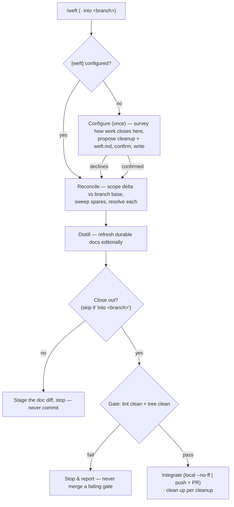

Close out a unit of work: scope the session's git delta, distill what landed into the durable docs, and — on opt-in — gate, merge, and clean up. weft is the session-*close* bookend to `/warp` (session open) — where warp orients and sets up the workspace, weft **distills and closes**. It is the same close-out moves run the same way every session, with the variable bits in config and prose. Any prose weft writes follows loom's editorial ethos (see [doc-convention](../../references/doc-convention.md)): editorial before additive, compression as craft, no edit without durable signal.

weft is invoked whenever you wrap real work — often, but never automatically; a throwaway edit with nothing durable to distill can skip it. Like warp, the confirmation lives in a one-time **configure** pass, and after that weft **runs** the flow you already approved without re-litigating each step. Two invocations: **`/weft`** distills, stages the doc diff, and asks whether to close out and into which branch; **`/weft into <branch>`** names the target up front and skips that question.

weft is **mostly REPO OPINION**, split across loom's two planes:

- **`loom.toml [weft]` — the control plane (enforced).** The mechanical knob the runtime acts on: `cleanup` (`"always"`|`"never"`|`"ask"` — after a successful merge, delete the work branch and prune its worktree). Thin by design: most of close-out is either a universal rail (the gate, `--no-ff`) or a per-branch convention (local merge vs. PR), neither of which is a repo-wide switch. When the section is present the linter **requires** and validates it, so run-mode can trust it without re-asking.
- **`.loom/weft.md` — the prose plane (suggestion).** The freeform nudge — *what* to distill and *where*, what to prune once shipped, and the close-out convention (e.g. `feature/<slug>` merges locally into the default branch; `issue/<n>` pushes and opens an MR). weft reads and follows it; it never has to exist.

**MUST:** the close-out **gate** — lint clean *and* the untracked/missing check both pass before any merge; the merge is always `--no-ff` with a written commit; commit only on close-out opt-in (plain `/weft` stages, never commits); distill editorially — **no edit without durable signal**; in **configure** mode, propose the flow and **write neither config nor docs until the operator confirms** (the symmetric twin of warp's configure rail). Everything the flow *does* between those rails is **DEFAULT / REPO OPINION**, shaped by `[weft]` and `.loom/weft.md`. Assume no specific tools exist: compose only what the config names, and when a named tool is absent, **say so and continue** — never hard-fail a close-out (no PR tool → push and report, don't block).

## Load the repo's opinion first

Read `.loom/weft.md` if it exists (relocatable via `[skills] config_dir`); it shapes *what* you distill and *where*, what to prune, and the close-out convention. It never relaxes the gate. See [repo-overrides](../../references/repo-overrides.md).

## The spine

### Configure — the rare setup pass

First run on a repo (no `[weft]` section), or `/weft configure` to re-tune — the same survey → propose → confirm → write spine `/dress` uses. Survey how the repo already closes work — what merges into the default branch in `git log`, whether branches are deleted after merge, any spec/plan trees that get pruned — then **propose** the `cleanup` knob and the `.loom/weft.md` nudge as a plan the operator edits cell by cell. Write `[weft]` into `.loom/loom.toml` and the nudge into `.loom/weft.md` (`kind: loom-config`) **only past the operator's confirm**. If the operator declines, skip to a plain distill-and-stage and hand back — never write a half-specified flow.

### Run — the lean pass

With `[weft]` present, execute the confirmed flow and prompt only where you genuinely must:

1. **Reconcile.** Scope the session against the branch base — where warp opened: `git log` / `git diff <base>..HEAD` names what landed and any direction abandoned. Then sweep the spares: `bash "${CLAUDE_PLUGIN_ROOT}/scripts/doc-scan"` and `git status --porcelain` surface every untracked (`??`/`A`) managed doc and frontmatter-less candidate created this session — resolve each: distill, adopt (give it frontmatter → managed), exclude (`[discovery] exclude`), or drop.
2. **Distill.** *(DEFAULT)* Refresh the touched durable docs from the **code**, editorially: the module README's frontmatter `updated` and `## Overview`, durable build/infra decisions into its `## Agentic Guidelines`, a new doc under `docs/` only if a result earns one. Move the roadmap only on milestone events (`## Now`/`## Next`, check off `## Milestones`) — no per-session entry; git is the activity log. Prune per `.loom/weft.md`. Most sessions stop at a paragraph; **if nothing durable changed, write nothing.** Then run `bash "${CLAUDE_PLUGIN_ROOT}/scripts/doc-linter"`, fix what it flags, and `git add` the doc diff.
3. **Close out** *(on opt-in; skip the ask when invoked as `/weft into <branch>`)*. The **gate (MUST)** — `doc-linter` exits 0 **and** `git status --porcelain` is resolved (every `??`/` D` staged or explained); never merge through a failing gate, no size exemption. Then commit the sync on the work branch, and integrate per the close-out convention: a local `git merge --no-ff` into the target with a written merge commit (the last step; re-run the linter on the result), or push and open an MR. **Clean up per `cleanup`:** delete the merged branch and `git worktree prune`, or skip if `never` / the operator wants it kept.

## Red flags

| Thought | Reality |
|---|---|
| "Trivial doc change — skip the gate." | The gate has no size exemption: lint clean + tree clean, every close-out. |
| "Lint's almost clean; I'll merge and fix after." | Never merge through a failing gate. Fix first, then merge. |
| "A fast-forward is cleaner here." | Always `--no-ff`. weft writes no session journal — the merge commit *is* the record. |
| "Plain `/weft`, but I'll commit to be helpful." | Plain `/weft` stages only. Committing is the operator's opt-in. |
| "First run, no config — I'll pick a cleanup default and go." | Configure is a propose→confirm pass. weft writes no config until the operator confirms — or declines, and weft just distills and stages. |
| "Nothing durable changed, but I'll refresh a few docs to be thorough." | No edit without durable signal. If the session changed nothing durable, write nothing and say so. |

## Output

Report the delta scoped and spares resolved, files touched with one-line rationales, what was pruned, and whether the roadmap moved and why; when nothing durable changed, say so and make no edit. In close-out mode, also report the gate result, the sync commit, the merge/MR, and whether the branch/worktree was cleaned up. In configure mode, report the `[weft]` knob and the `.loom/weft.md` written. weft commits only on close-out opt-in.
